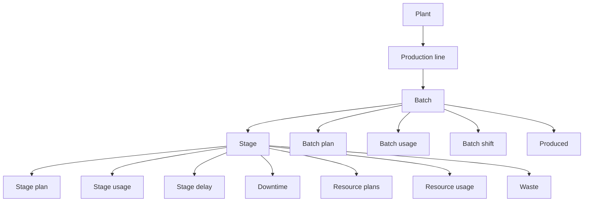
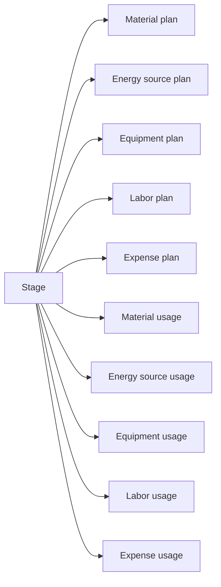
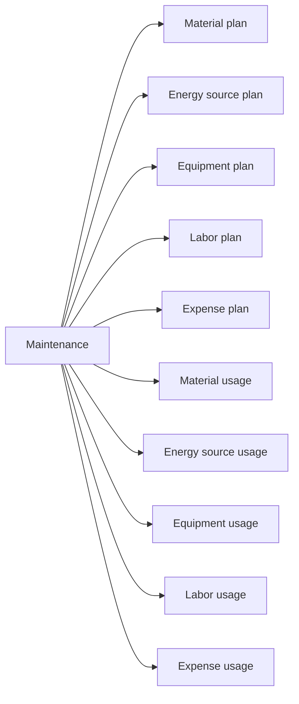
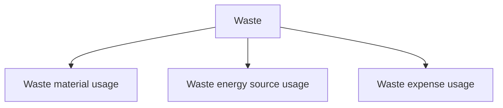
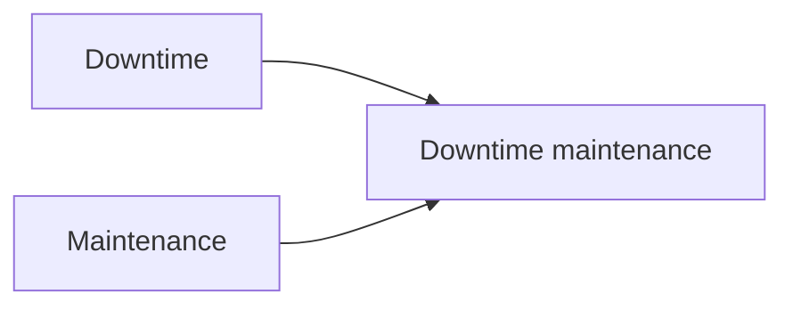

# Relationships

Pulse entities are connected through integer identifiers.

Create or retrieve referenced records before submitting dependent records.

## Core operational relationships



## Shared identity

The following records share their parent `id`:

| Parent | Related records |
| --- | --- |
| [Batch](../integration/manufacturing/batch.md) | [Batch plan](../integration/manufacturing/batch-plan.md), [Batch usage](../integration/manufacturing/batch-usage.md) |
| [Stage](../integration/manufacturing/stage.md) | [Stage plan](../integration/manufacturing/stage-plan.md), [Stage usage](../integration/manufacturing/stage-usage.md) |
| [Downtime](../integration/manufacturing/downtime.md) | [Downtime plan](../integration/manufacturing/downtime-plan.md), [Downtime usage](../integration/manufacturing/downtime-usage.md) |
| [Maintenance](../integration/maintenance/maintenance.md) | [Maintenance plan](../integration/maintenance/maintenance-plan.md), [Maintenance usage](../integration/maintenance/maintenance-usage.md) |

For example:

```text
Batch.id = BatchPlan.id = BatchUsage.id
```

Create or retrieve the parent record before submitting the related plan or usage record.

## Resource records

Resource plan and usage records reference the main operational entity directly.

Manufacturing resource records reference [Stage](../integration/manufacturing/stage.md):



Maintenance resource records reference [Maintenance](../integration/maintenance/maintenance.md):



Resource records do not reference Stage plan, Stage usage, Maintenance plan, or Maintenance usage directly.

## Waste relationships

A [Waste](../integration/manufacturing/waste.md) record identifies waste, scrap, loss, or another unusable quantity associated with a Stage.

Waste detail records reference the Waste record:



## Downtime and maintenance

[Downtime](../integration/manufacturing/downtime.md) and [Maintenance](../integration/maintenance/maintenance.md) are separate entities.

[Downtime maintenance](../integration/manufacturing/downtime-maintenance.md) links them and defines the share of a maintenance activity attributed to a downtime event.



The percentage is submitted as a decimal fraction. For example, 25% is `0.25`.

## Dimension relationships

Records such as Ambient value can use `dimension` and `dimensionId` instead of a fixed reference field.

The selected [Dimension](dimension.md) determines what type of record `dimensionId` identifies.

For example:

```json
{
  "dimension": 3,
  "dimensionId": 208
}
```

This combination identifies Stage `208`.

## Submission order

A safe submission sequence is:

1. Master data.
2. Main operational entity.
3. Shared-identity plan and usage records.
4. Resource plans and usage.
5. Output, downtime, waste, and measurements.
6. Relationship records such as Downtime maintenance.
