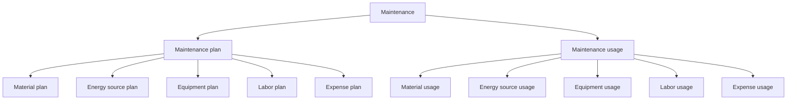

# Maintenance

Maintenance data describes preventive and corrective maintenance activities, their planned requirements, and their actual execution.

A Maintenance record identifies the activity. Related plan and usage records describe timing, resources, and costs.

## Maintenance structure

## Available maintenance data

### Core records

| Resource | Purpose |
| --- | --- |
| [**Maintenance**](maintenance.md) | Identifies and classifies a preventive or corrective maintenance activity. |
| [**Maintenance plan**](maintenance-plan.md) | Describes the planned timing of a maintenance activity. |
| [**Maintenance usage**](maintenance-usage.md) | Describes the actual timing of a maintenance activity. |

### Resource plans

| Resource | Purpose | Master data reference |
| --- | --- | --- |
| [**Maintenance material plan**](maintenance-material-plan.md) | Describes planned material quantity and price. | [Material](../master-data/material.md) |
| [**Maintenance energy source plan**](maintenance-energy-source-plan.md) | Describes planned energy quantity and price. | [Energy source](../master-data/energy-source.md) |
| [**Maintenance equipment plan**](maintenance-equipment-plan.md) | Describes planned equipment hours and hourly price. | [Equipment](../master-data/equipment.md) |
| [**Maintenance labor plan**](maintenance-labor-plan.md) | Describes planned labor hours and hourly price. | [Labor](../master-data/labor.md) |
| [**Maintenance expense plan**](maintenance-expense-plan.md) | Describes a planned additional expense. | [Expense](../master-data/expense.md) |

### Resource usage

| Resource | Purpose | Master data reference |
| --- | --- | --- |
| [**Maintenance material usage**](maintenance-material-usage.md) | Records actual material quantity and price. | [Material](../master-data/material.md) |
| [**Maintenance energy source usage**](maintenance-energy-source-usage.md) | Records actual energy quantity and price. | [Energy source](../master-data/energy-source.md) |
| [**Maintenance equipment usage**](maintenance-equipment-usage.md) | Records actual equipment hours and hourly price. | [Equipment](../master-data/equipment.md) |
| [**Maintenance labor usage**](maintenance-labor-usage.md) | Records actual labor hours and hourly price. | [Labor](../master-data/labor.md) |
| [**Maintenance expense usage**](maintenance-expense-usage.md) | Records an actual additional expense. | [Expense](../master-data/expense.md) |

## Submission order

Submit parent records before records that reference them.

1. Synchronize the required [master data](../master-data/index.md).
2. Create the Maintenance record.
3. Submit the Maintenance plan and planned resources.
4. Submit Maintenance usage and actual resource usage.
5. Link related downtime through [Downtime maintenance](../manufacturing/downtime-maintenance.md), when applicable.

When a request requires a Pulse `id`, retrieve the related record by its `code` and use the returned `id`.

## Time and prices

Use consistent timestamps and time zones across related maintenance records.

> [!NOTE]
> When a price is based on elapsed time, Pulse expresses it per hour. Although Pulse commonly represents durations internally using ticks, hours are used for time-based price calculations.

Material and energy prices use the configured measure unit. Expense prices use the applicable expense unit.

See the [API reference](../../api/index.md) for supported operations and complete request schemas.
