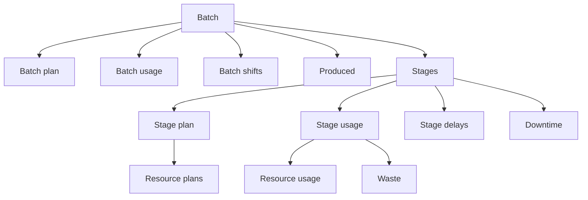

# Manufacturing

Manufacturing data describes planned and actual operational activity submitted to Pulse.

These records connect batches, stages, resource plans, actual usage, output, downtime, delays, waste, shifts, and measurements.

> [!IMPORTANT]
> A **batch** is not limited to production. It represents a broader operational unit of work, such as a production run, supply activity, logistics operation, service process, or another grouped activity tracked in Pulse.

Before submitting manufacturing data, synchronize the required [master data](../master-data/index.md).

## Manufacturing structure

Plans describe expected activity. Usage records describe actual activity.

## Available manufacturing data

### Core records

| Resource | Purpose |
| --- | --- |
| [**Batch**](batch.md) | Represents an operational unit of work and its business context. |
| [**Batch plan**](batch-plan.md) | Describes the planned timing and quantity of a batch. |
| [**Batch usage**](batch-usage.md) | Describes the actual timing of a batch. |
| [**Batch shift**](batch-shift.md) | Assigns shifts to a batch during specific intervals. |
| [**Produced**](produced.md) | Records output quantities and quality classification. |
| [**Stage**](stage.md) | Represents an operation or execution step within a batch. |
| [**Stage plan**](stage-plan.md) | Describes the planned timing of a stage. |
| [**Stage usage**](stage-usage.md) | Describes the actual timing of a stage. |
| [**Stage delay**](stage-delay.md) | Records a delay associated with a stage. |
| [**Ambient value**](ambient-value.md) | Records a measured value in a specific operational context. |

### Resource plans

| Resource | Purpose | Master data reference |
| --- | --- | --- |
| [**Material plan**](material-plan.md) | Describes the planned quantity and price of material used during a stage. | [Material](../master-data/material.md) |
| [**Energy source plan**](energy-source-plan.md) | Describes the planned quantity and price of an energy source used during a stage. | [Energy source](../master-data/energy-source.md) |
| [**Equipment plan**](equipment-plan.md) | Describes the planned use and price of equipment during a stage. | [Equipment](../master-data/equipment.md) |
| [**Equipment plan period**](equipment-plan-period.md) | Describes a specific interval during which equipment is planned for use. | — |
| [**Labor plan**](labor-plan.md) | Describes the planned quantity and price of labor during a stage. | [Labor](../master-data/labor.md) |
| [**Labor plan period**](labor-plan-period.md) | Describes a specific interval during which labor is planned for a stage. | — |
| [**Expense plan**](expense-plan.md) | Describes an additional cost planned for a stage. | [Expense](../master-data/expense.md) |

### Resource usage

| Resource | Purpose | Master data reference |
| --- | --- | --- |
| [**Material usage**](material-usage.md) | Records the actual quantity and price of material used during a stage. | [Material](../master-data/material.md) |
| [**Energy source usage**](energy-source-usage.md) | Records the actual quantity and price of an energy source used during a stage. | [Energy source](../master-data/energy-source.md) |
| [**Equipment usage**](equipment-usage.md) | Records the actual use and price of equipment during a stage. | [Equipment](../master-data/equipment.md) |
| [**Equipment usage period**](equipment-usage-period.md) | Records a specific interval during which equipment was actually used. | — |
| [**Labor usage**](labor-usage.md) | Records the actual quantity and price of labor used during a stage. | [Labor](../master-data/labor.md) |
| [**Labor usage period**](labor-usage-period.md) | Records a specific interval during which labor was actually performed. | — |
| [**Expense usage**](expense-usage.md) | Records an additional cost incurred during a stage. | [Expense](../master-data/expense.md) |

### Downtime

| Resource | Purpose |
| --- | --- |
| [**Downtime**](downtime.md) | Records a downtime event associated with a stage. |
| [**Downtime plan**](downtime-plan.md) | Describes the planned downtime interval. |
| [**Downtime usage**](downtime-usage.md) | Describes the actual downtime interval. |
| [**Downtime maintenance**](downtime-maintenance.md) | Links a downtime event to a maintenance activity. |

### Waste

| Resource | Purpose |
| --- | --- |
| [**Waste**](waste.md) | Records waste, scrap, loss, or another unusable quantity. |
| [**Waste material usage**](waste-material-usage.md) | Records material attributed to waste. |
| [**Waste energy source usage**](waste-energy-source-usage.md) | Records energy attributed to waste. |
| [**Waste expense usage**](waste-expense-usage.md) | Records additional expenses attributed to waste. |

## Submission order

Submit parent records before records that reference them.

1. Synchronize the required [master data](../master-data/index.md).
2. Create the batch.
3. Submit batch plan, usage, shifts, and produced quantities as applicable.
4. Create the stages that belong to the batch.
5. Submit stage plans and stage usage.
6. Submit resource plans and actual usage.
7. Submit delays, downtime, waste, and measurements.

When a request requires a Pulse `id`, retrieve the related record by its `code` and use the returned `id`.

## Time and prices

Use consistent timestamps and time zones across all manufacturing records.

> [!NOTE]
> When a price is based on elapsed time, Pulse expresses it per hour. Although Pulse commonly represents durations internally using ticks, hours are used for time-based price calculations.

Prices associated with materials, energy sources, products, or other measured quantities use the configured measure unit.

See the [API reference](../../api/index.md#manufacturing) for the available manufacturing services and endpoint paths.