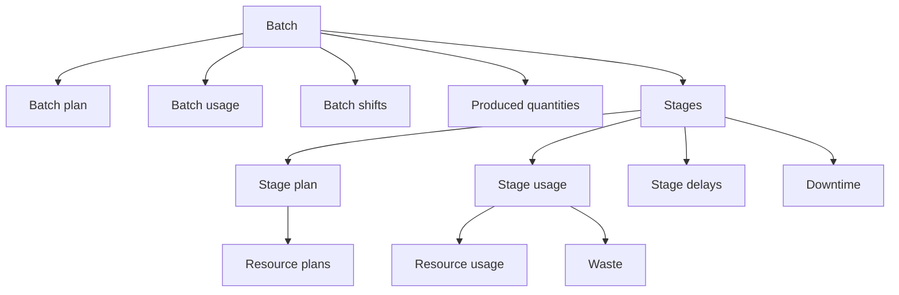

# Manufacturing

Manufacturing data describes planned and actual operational activity submitted to Pulse.

These records connect batches, stages, resource plans, actual usage, output, downtime, delays, waste, shifts, and measurements. Together, they provide the operational context Pulse needs to compare what was expected with what actually happened.

A batch is not limited to production. It represents a broader operational unit of work, such as a production run, supply activity, logistics operation, service process, or another grouped activity tracked in Pulse.

Before submitting manufacturing data, synchronize the required [master data](../master-data/index.md).

## Manufacturing structure

Manufacturing records follow a hierarchy:

A batch represents the broader operational activity. Stages divide the batch into individual operations or execution steps. Plans describe expected activity, while usage records describe actual activity.

## Planned and actual data

Pulse separates planned values from actual execution data.

| Data type | Purpose |
| --- | --- |
| **Plan** | Describes the expected time, quantity, cost, or resource requirement |
| **Usage** | Describes the actual time, quantity, cost, or resource consumption |
| **Period** | Describes a time interval associated with labor or equipment |
| **Waste** | Describes resources or value lost during execution |

This separation allows Pulse to compare expectations with actual results and identify operational deviations.

## Available manufacturing data

### Core production records

| Resource | Purpose |
| --- | --- |
| [**Batch**](batch.md) | Represents an operational unit of work and its business context. |
| **Batch plan** | Describes the planned timing of a batch. |
| **Batch usage** | Describes the actual timing of a batch. |
| [**Batch shift**](batch-shift.md) | Assigns one or more shifts to a batch. |
| **Produced** | Records outputs and their quality classification. |
| **Stage** | Represents an operation or execution step within a batch. |
| **Stage plan** | Describes the planned timing of a stage. |
| **Stage usage** | Describes the actual timing of a stage. |
| [**Stage delay**](stage-delay.md) | Records a delay associated with a stage. |
| [**Ambient value**](ambient-value.md) | Records a measured value linked to the manufacturing context. |

### Resource plans

Resource plans describe the quantities and prices expected during a stage.

| Resource | Master data reference |
| --- | --- |
| [**Material plan**](material-plan.md) | [Material](../master-data/material.md) |
| [**Energy source plan**](energy-source-plan.md) | [Energy source](../master-data/energy-source.md) |
| [**Equipment plan**](equipment-plan.md) | [Equipment](../master-data/equipment.md) |
| [**Labor plan**](labor-plan.md) | [Labor](../master-data/labor.md) |
| **Expense plan** | [Expense](../master-data/expense.md) |

### Resource usage

Resource usage records describe the quantities and prices actually consumed during a stage.

| Resource | Master data reference |
| --- | --- |
| [**Material usage**](material-usage.md) | [Material](../master-data/material.md) |
| [**Energy source usage**](energy-source-usage.md) | [Energy source](../master-data/energy-source.md) |
| [**Equipment usage**](equipment-usage.md) | [Equipment](../master-data/equipment.md) |
| [**Labor usage**](labor-usage.md) | [Labor](../master-data/labor.md) |
| **Expense usage** | [Expense](../master-data/expense.md) |

### Downtime and waste

| Resource | Purpose |
| --- | --- |
| [**Downtime**](downtime.md) | Records a downtime event associated with a stage. |
| **Downtime plan** | Describes planned downtime. |
| **Downtime usage** | Describes actual downtime. |
| [**Waste**](waste.md) | Records waste generated during stage execution. |
| [**Waste material usage**](waste-material-usage.md) | Records material associated with waste. |
| [**Waste energy source usage**](waste-energy-source-usage.md) | Records energy associated with waste. |
| **Waste expense usage** | Records expenses associated with waste. |

## Submission order

Submit parent records before the records that reference them.

A typical sequence is:

1. Synchronize the required master data.
2. Create the batch.
3. Submit the batch plan, usage, shifts, and produced quantities as applicable.
4. Create the stages that belong to the batch.
5. Submit stage plans and stage usage.
6. Submit resource plans and actual usage.
7. Submit delays, downtime, waste, and measurements.

When a request requires a Pulse `id`, retrieve the related record by its `code` and use the returned `id`.

## Time and prices

Use consistent timestamps and time zones across all manufacturing records.

> [!NOTE]
> When a price is based on elapsed time, Pulse expresses it per hour. Although Pulse commonly represents durations internally using ticks, hours are used for time-based price calculations.

Prices associated with materials, energy sources, products, or other measured quantities use the configured measure unit.

See the [API reference](../../api/index.md#manufacturing) for the available manufacturing services and endpoint paths.