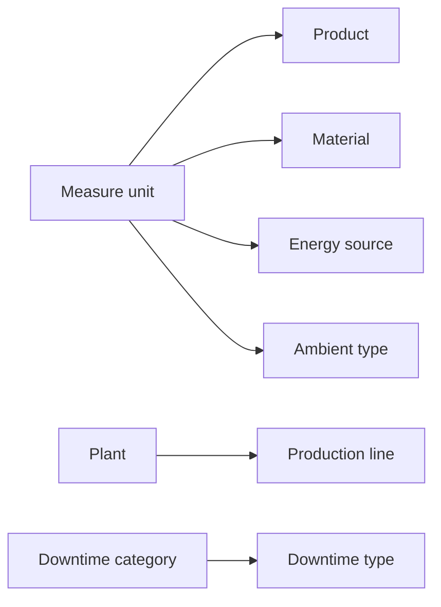

# Master data and code lists

Master data and code lists define the reference records used by operational data submitted to Pulse.

They include plants, production lines, products, materials, equipment, shifts, units of measure, suppliers, and classification records such as downtime types and waste types.

Synchronize the required code lists before submitting operational records that reference them.

## Available master data and code lists

### Organization and production structure

| Resource | Purpose |
| --- | --- |
| **Plant** | Represents a physical or organizational operating location. |
| **Production line** | Represents a production line associated with a plant. |
| **Equipment** | Represents a machine, asset, or other equipment used during an activity. |
| **Shift** | Represents a defined work shift. |

### Products and resources

| Resource | Purpose |
| --- | --- |
| **Product** | Represents an output or item produced during an activity. |
| **Material** | Represents material consumed or referenced during an activity. |
| **Measure unit** | Defines the unit used for quantities and measurements. |
| **Labour** | Represents a labour category or resource used during an activity. |
| **Energy source** | Represents a type of energy consumed during an activity. |
| **Expense** | Represents an additional type of cost. |
| **Supplier** | Represents the supplier associated with material or energy usage. |

### Classification data

| Resource | Purpose |
| --- | --- |
| **Downtime category** | Groups related downtime types. |
| **Downtime type** | Defines a planned or unplanned type of downtime. |
| **Downtime cause** | Defines the cause associated with downtime. |
| **Waste type** | Defines a classification for waste. |
| **Delay** | Defines a type of delay. |
| **Ambient type** | Defines a measurement type, its unit, and expected value range. |

See the [API reference](../api/index.md) for the available services and endpoint paths.

## Identifiers

Master-data and code-list records generally use the following identifiers:

| Field | Assigned by | Purpose |
| --- | --- | --- |
| `Code` | Source system | Identifies the corresponding record in the source system. |
| `Id` | Pulse | Identifies the record in Pulse and is used when other records reference it. |

Fields such as `Plant`, `MeasureUnit`, and `Category` contain the Pulse `Id` of a related record. They define relationships between records rather than additional identifiers for the current record.

For example:

| Source-system record | Pulse record |
| --- | --- |
| `Code: PRODUCT-001` | `Id: 21` |

When an insert operation succeeds, Pulse commonly returns the numeric `Id` assigned to the new record.

Store the relationship between the source-system `Code` and the Pulse `Id`. Use the Pulse `Id` when submitting records that reference this product.

## Dependencies

Some master-data records refer to other master-data records.



For example:

- a production line references a plant;
- a product references a unit of measure;
- a material references a unit of measure;
- an energy source references a unit of measure;
- a downtime type references a downtime category;
- an ambient type references a unit of measure.

Create or retrieve the referenced record before submitting the dependent record.

## Example: product mapping

Suppose your source system contains:

| Field | Value |
| --- | --- |
| Product code | `PRODUCT-001` |
| Name | `Product 001` |
| Price | `4.00` |
| Unit | `piece` |

Before submitting the product, obtain the Pulse `Id` of the corresponding `piece` unit.

The request body then uses that Pulse identifier:

```json
{
  "MeasureUnit": 1,
  "Code": "PRODUCT-001",
  "Name": "Product 001",
  "Price": 4.00
}
```

A successful insert returns the Pulse identifier for the newly created record:

```json
21
```

Store the mapping:

```text
PRODUCT-001 → 21
```

Use `21` whenever another Pulse record must reference this product.

## Synchronization approach

A master-data synchronization typically performs these steps:

1. Read the relevant records from the source system.
2. Transform each record into the Pulse request format.
3. Submit the corresponding record to Pulse.
4. Read the returned Pulse identifier.
5. Store the relationship between the source record and the Pulse record.
6. Log failures for retry or correction.

Use [Scalar](https://scalar.com/) to inspect endpoint schemas and test individual requests. Implement recurring or bulk synchronization in your integration application or service.