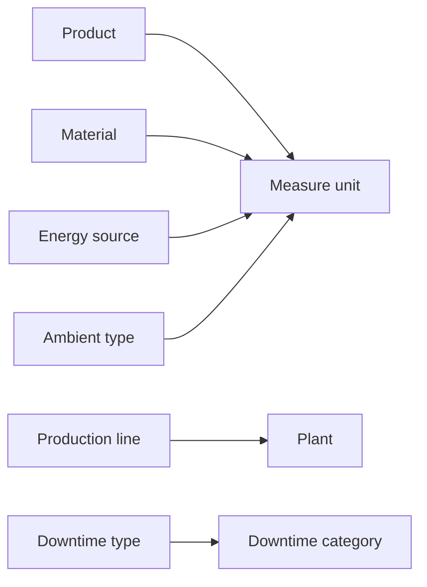

# Master data

Master data defines the relatively stable business entities and code lists referenced by operational data submitted to Pulse.

It includes plants, production lines, products, materials, equipment, shifts, units of measure, suppliers, and classification records such as downtime types and waste types.

Synchronize the required master data before submitting operational records that reference them.

## Available master data

### Organization and production structure

| Resource | Purpose |
| --- | --- |
| [**Plant**](plant.md) | Represents a physical or organizational operating location. |
| [**Production line**](production-line.md) | Represents a production line associated with a plant. |
| [**Equipment**](equipment.md) | Represents a machine, asset, or other equipment used during an activity. |
| [**Shift**](shift.md) | Represents a defined work shift. |

### Products and resources

| Resource | Purpose |
| --- | --- |
| [**Measure unit**](measure-unit.md) | Defines the unit used for quantities and measurements. |
| [**Product**](product.md) | Represents an output or item produced during an activity. |
| [**Material**](material.md) | Represents material consumed or referenced during an activity. |
| [**Labor**](labor.md) | Represents a labor category or resource used during an activity. |
| [**Energy source**](energy-source.md) | Represents a type of energy consumed during an activity. |
| [**Expense**](expense.md) | Represents an additional type of cost. |
| [**Supplier**](supplier.md) | Represents the supplier associated with material or energy usage. |
| [**Customer**](customer.md) | Represents a customer associated with a product or service. |

### Classification data

| Resource | Purpose |
| --- | --- |
| [**Downtime category**](downtime-category.md) | Groups related downtime types. |
| [**Maintenance reason**](maintenance-reason.md) | Defines a reason for maintenance activities. |
| [**Downtime type**](downtime-type.md) | Defines a planned or unplanned type of downtime. |
| [**Downtime cause**](downtime-cause.md) | Defines the cause associated with downtime. |
| [**Waste type**](waste-type.md) | Defines a classification for waste. |
| [**Delay**](delay.md) | Defines a type of delay. |
| [**Ambient type**](ambient-type.md) | Defines a measurement type, its unit, and expected value range. |

See the [API reference](../../api/index.md) for the available services and endpoint paths.

### Time-based prices

> [!NOTE]
> When a price is based on elapsed time, Pulse expresses it per hour. Although Pulse commonly represents durations internally using ticks, hours are used for time-based price calculations.

## Identifiers

Master-data and code-list records generally use the following identifiers:

| Field | Assigned by | Purpose |
| --- | --- | --- |
| `code` | Source system | Identifies the record in external systems and is used to retrieve it from Pulse. |
| `id` | Pulse | Identifies the record in Pulse and is used when other records reference it. |

Fields such as `plant`, `measureUnit`, and `category` contain the Pulse `id` of a related record. They define relationships between records rather than additional identifiers for the current record.

For example:

| Source-system record | Pulse record |
| --- | --- |
| `code: PRODUCT-001` | `id: 21` |

When an insert operation succeeds, Pulse commonly returns the numeric `id` assigned to the new record.

When another request requires the Pulse `id`, retrieve the corresponding record by its `code` and use the returned `id`.

## Dependencies

Some master-data records refer to other master-data records.



For example:

- A production line references a plant.
- A product references a measure unit.
- A material references a measure unit.
- An energy source references a measure unit.
- A downtime type references a downtime category.
- An ambient type references a measure unit.

Create or retrieve the referenced record before submitting the dependent record.

## Example: product mapping

Suppose your source system contains:

| Field | Value |
| --- | --- |
| Product code | `PRODUCT-001` |
| Name | `Product 001` |
| Unit | `piece` |

Before submitting the product, obtain the Pulse `id` of the corresponding `piece` unit.

The request body then uses that Pulse identifier:

```json
{
  "measureUnit": 1,
  "code": "PRODUCT-001",
  "name": "Product 001"
}
```

A successful insert returns the Pulse identifier for the newly created record:

```json
21
```

When another request needs to reference this product, retrieve the product by its `code`.

Pulse returns the corresponding record, including its `id`:

```json
{
  "id": 21,
  "code": "PRODUCT-001",
  "name": "Product 001",
  "measureUnit": 1
}
```

Use the returned `id` in the related request.

> [!NOTE]
> The example shows the minimum commonly required fields. Optional fields such as `price` and `description` can also be included when available in the source system.


## Synchronization approach

A master-data synchronization typically performs these steps:

1. Read the relevant records from the source system.
2. Transform each record into the Pulse request format.
3. Submit the corresponding record to Pulse.
4. Verify that the record was submitted successfully.
5. Retrieve Pulse identifiers by `code` when related records require them.
6. Log failures for retry or correction.

Use [Scalar](https://scalar.com/) to inspect endpoint schemas and test individual requests. Implement recurring or bulk synchronization in your integration application or service.