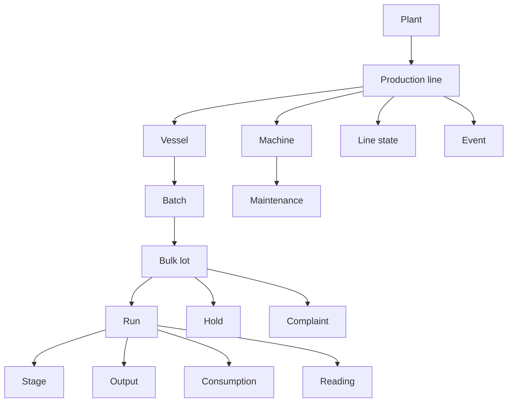

# Food & Beverage data model

The Food & Beverage model connects production structure, production work, traceability, measurements, maintenance, and quality records through stable business codes.

## Model overview



The main relationships are:

- A **plant** contains production lines.
- **Machines** and **vessels** belong to production lines.
- A **batch** represents bulk process production and can produce a traceable lot.
- A **run** represents production of a product on a line and can draw from one or more process batches.
- **Stages** describe execution steps within a run.
- **Consumption**, **output**, and **readings** describe what happened during production.
- **Line states** account for constrained or non-running line time.
- **Holds** and **complaints** connect quality issues to traceable lots.
- **Maintenance** records work performed on machines.

## Business-code relationships

Food & Beverage API requests reference related records by business code rather than Pulse numeric identifiers.

For example:

```json
{
  "code": "L03-260810-002",
  "line": "L03",
  "product": "SKU-4471",
  "recipe": "REC-4471-v3"
}
```

The values of `line`, `product`, and `recipe` identify previously registered records by their business codes.

Register referenced records before submitting records that depend on them.

## Explore the model

- [Master data](master-data/index.md)
- [Production activities](production-activities/index.md)
- [Operational data](operational-data/index.md)
- [Maintenance and quality](maintenance-and-quality/index.md)
- [Definitions and rules](definitions-and-rules/index.md)

Individual resource pages document their specific dependencies and API paths.