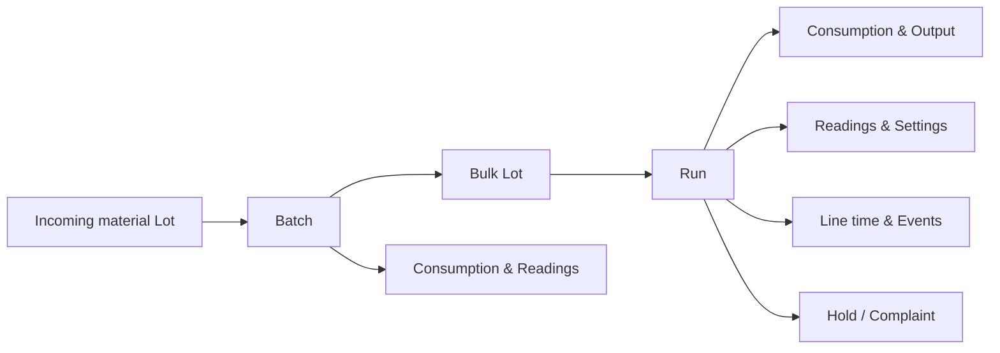
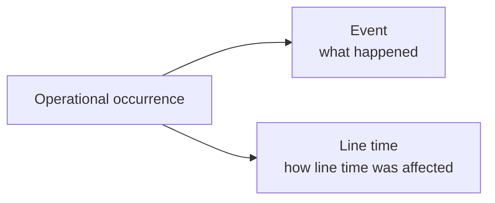
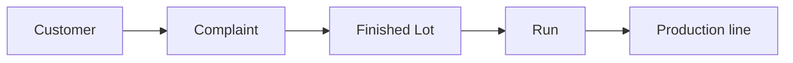
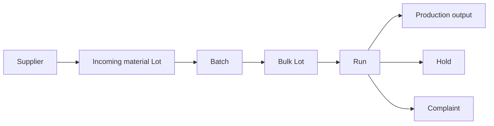
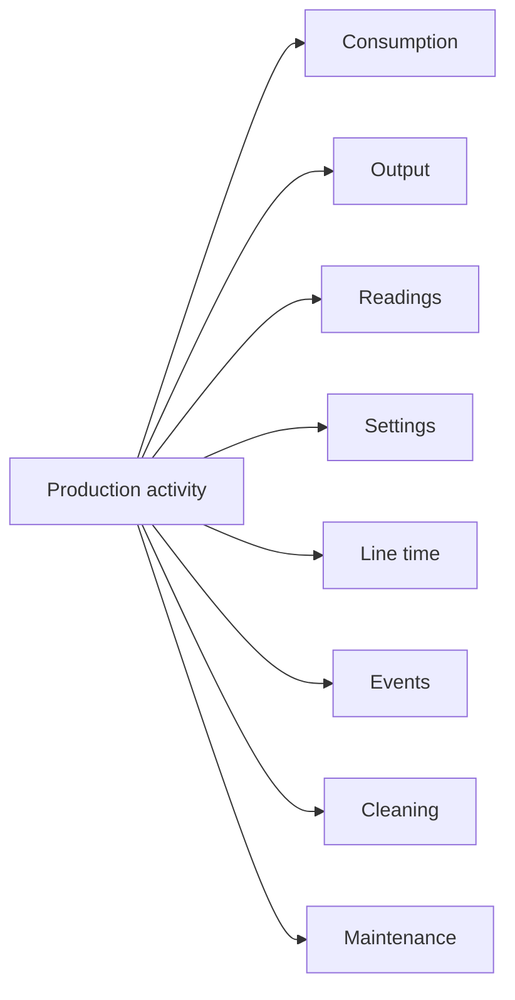

# End-to-end integration example

This example shows how data from several source systems can flow into the Food & Beverage model over the course of a production process.

It is not a sequence an engineer performs manually. In a real integration, these records are usually submitted automatically by systems such as ERP, MES, historians, QMS, maintenance systems, or file-based interfaces.

## Example flow

A dairy site receives raw milk, processes it into a bulk yogurt Batch, packs the Product on a Production line, and later records quality or maintenance information linked to that production history.



## 1. Synchronize master data

Stable records are typically synchronized before operational data begins to arrive.

For this example, the integration may register:

- [Site](master-data/site.md)
- [Production line](master-data/production-line.md)
- [Machine](master-data/machine.md)
- [Vessel](master-data/vessel.md)
- [Product](master-data/product.md)
- [Recipe](master-data/recipe.md)
- [Material](master-data/material.md)
- [Cost line](master-data/cost-line.md)
- [Supplier](master-data/supplier.md)
- [Customer](master-data/customer.md)
- [Shift](master-data/shift.md)
- [Crew](master-data/crew.md)

These records are referenced later by their business codes.

## 2. Register definitions and rules

Before submitting measurements and other operational records, register the definitions and rules required by the integration.

These may include:

- [Measurement](definitions-and-rules/measurement.md)
- [Product limit](definitions-and-rules/product-limit.md)
- [Target](definitions-and-rules/target.md)
- [Clean regime](definitions-and-rules/clean-regime.md)
- [Cleaning rule](definitions-and-rules/cleaning-rule.md)
- [Reason](definitions-and-rules/reason.md)
- [Type](definitions-and-rules/type.md)

For example, Measurements define the codes used later by Readings and Settings, while Reasons provide consistent classifications for operational and quality records.

## 3. Register incoming material lots

When traceable raw material is received, register the corresponding [Lot](production-activities/lot.md).

For example, a raw-milk Lot can identify:

- the Material;
- the Supplier;
- the received quantity and unit;
- expiry information;
- lot-specific analysis values.

```text
Supplier
   ↓
Incoming Lot
   ↓
Material available for production
```

This establishes the first traceability link in the production flow.

## 4. Record the process batch

When bulk processing starts, create a [Batch](production-activities/batch.md).

The Batch identifies the Vessel and can reference the Recipe used during processing.

For example:

```text
Incoming Lots
     ↓
   Batch
     ↓
  Bulk Lot
```

The Batch itself produces a bulk Lot with the same business code.

Actual ingredients, utilities, Labor, equipment, and other resources used during processing are submitted through [Consumption](operational-data/consumption.md).

Process measurements such as temperature, pH, pressure, or Brix are submitted as [Readings](operational-data/reading.md).

Expected resource use can be recorded beforehand through [Planned use](production-activities/planned-use.md).

## 5. Record the production run

When bulk Product is filled or packed, create a [Run](production-activities/run.md).

The Run identifies the Production line and Product and can also reference:

- Recipe;
- Shift;
- Crew;
- one or more source Lots.

For example:

```text
Bulk Lot
   ↓
  Run
   ↓
Packed Product
```

Execution steps within the Run can be represented through [Stage](production-activities/stage.md) records.

During the Run, the integration can submit:

- [Consumption](operational-data/consumption.md) for actual Material, Labor, utility, equipment, and other resource use;
- [Output](operational-data/output.md) for good production, waste, downgrade, and reject quantities;
- [Reading](operational-data/reading.md) for measured process values;
- [Setting](operational-data/setting.md) for commanded or configured Machine values.

This keeps measured values and equipment setpoints separate:

```text
Measured value  → Reading
Commanded value → Setting
```

## 6. Record line conditions and events

When a Production line is not operating normally, record the interval through [Line time](operational-data/line-time.md).

For example:

```json
{
  "line": "LINE001",
  "condition": "breakdown",
  "reason": "DTCU010",
  "toldBy": "equipment",
  "from": "2026-08-11T03:40:00+02:00",
  "to": "2026-08-11T04:05:00+02:00"
}
```

Only non-running or constrained conditions are submitted. Productive `running` time can be derived from the gaps between recorded intervals.

Discrete occurrences such as stoppages, waste incidents, deviations, or changeovers can be recorded separately as [Events](operational-data/event.md).



The two resources are complementary: Event makes an occurrence countable and attributable, while Line time accounts for its duration.

## 7. Record cleaning

Cleaning between Products is represented through [Clean](production-activities/clean.md).

A Clean identifies:

- the Production line;
- the Clean regime;
- the Product before cleaning;
- the Product after cleaning;
- the actual cleaning interval.

The Product transition can be compared with the applicable [Cleaning rule](definitions-and-rules/cleaning-rule.md).

Expected resources can be submitted through [Planned use](production-activities/planned-use.md), while actual chemicals, water, energy, Labor, or other resources are submitted through [Consumption](operational-data/consumption.md).

## 8. Record maintenance

Maintenance work is represented through a [Work order](maintenance-and-quality/work-order.md).

A Work order identifies the maintained Machine or component, whether the work was corrective or preventive, and its planned and actual timing.

Resources associated with maintenance are submitted through [Parts and Labor](maintenance-and-quality/parts-and-labor.md).

For example:

```text
Work order
├── planned Labor
├── actual Labor
├── spare parts
└── other maintenance costs
```

When `lineState` is supplied on the Work order, Pulse automatically creates the corresponding [Line time](operational-data/line-time.md) interval for the owning Production line.

Do not submit the same Line time interval separately.

## 9. Record quality holds

If Product is temporarily withheld while a quality decision is made, create a [Hold](production-activities/hold.md).

The Hold identifies:

- the affected Lot;
- the Product when applicable;
- the Reason;
- the affected quantity;
- when the Hold started;
- when it ended;
- the resulting decision.

Supported decisions are:

```text
released
downgraded
scrapped
```

A Hold remains open while `end` is null.

## 10. Record customer complaints

A customer-side issue that becomes known later can be recorded as a [Complaint](maintenance-and-quality/complaint.md).

A Complaint references:

- Customer;
- affected finished Lot;
- Product;
- reported Reason;
- when the Customer noticed the issue;
- when the Complaint reached the producer.

The finished Lot provides the production traceability.

Pulse can connect it back to the Run that produced it and the Production line on which that Run took place.



The Complaint can later be enriched with the investigation outcome, settlement, cost, and cause found.

## Resulting traceability

Across these resources, Pulse can preserve a production chain such as:



Operational context remains connected to the relevant part of that flow:



Together, the master data, definitions, production activities, operational records, and maintenance and quality records provide the context needed to reconstruct what happened during production and why.

## Next steps

Use the individual resource pages for field-level requirements, validation rules, and API examples.

For supported resources and operations, see the [API reference](api/index.md).