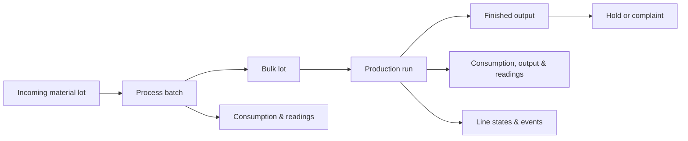
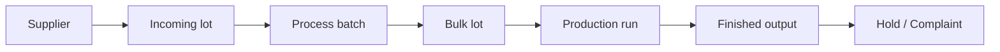

# End-to-end integration example

This example shows how data from several source systems can flow into the Food & Beverage model over the course of a production process.

It is not a sequence an engineer performs manually. In a real integration, these records are usually submitted automatically by systems such as ERP, MES, historians, QMS, maintenance systems, or file-based interfaces.

## Example flow

A dairy plant receives raw milk, processes it into a bulk yogurt batch, packs the product on a production line, and later receives a customer complaint linked to one finished lot.

## 1. Synchronize master data

Stable records are typically synchronized before operational data begins to arrive.

For this example, the integration may register:

- [Plant](master-data/site.md)
- [Production line](master-data/production-line.md)
- [Machine](master-data/machine.md)
- [Vessel](master-data/vessel.md)
- [Product](master-data/product.md)
- [Recipe](master-data/recipe.md)
- [Material](master-data/material.md)
- [Supplier](master-data/supplier.md)
- [Customer](master-data/customer.md)
- [Shift](master-data/shift.md)
- [Crew](master-data/crew.md)
- [Metric](master-data/metric.md)

These records are referenced later by their business codes.

## 2. Register incoming material lots

When traceable raw material is received, register the corresponding [Lot](master-data/lot.md).

For example, a raw-milk lot can identify:

- the material;
- the supplier;
- the received quantity;
- expiry information;
- lot-specific analysis values.

This establishes the first traceability link in the production flow.

## 3. Record the process batch

When bulk processing starts, create a [Batch](manufacturing/batch.md).

The batch can identify the vessel and recipe used during processing.

Actual ingredients, utilities, labor, and other resources used during the batch are submitted through [Consumption](manufacturing/consumption.md).

Process measurements such as temperature, pH, pressure, or Brix are submitted as [Readings](manufacturing/reading.md).

When processing finishes, the batch produces a traceable bulk lot.

## 4. Record the production run

When the bulk product is filled or packed, create a [Run](manufacturing/run.md).

The run identifies the production line, product, recipe, shift, crew, and source process batches where applicable.

Execution steps can be represented as [Stages](manufacturing/stage.md).

During the run, the integration can submit:

- [Consumption](manufacturing/consumption.md) for ingredients, packaging, labor, utilities, equipment, and other actual resource use;
- [Output](manufacturing/output.md) for good production, waste, downgrade, and rejects;
- [Readings](manufacturing/reading.md) for process measurements and setpoints.

## 5. Record line conditions and events

When the line is not operating normally, submit [Line states](manufacturing/line-state.md).

Examples include:

- breakdown;
- cleaning;
- changeover;
- waiting for material;
- reduced speed.

Discrete occurrences such as stoppages, deviations, rejects, or rework can be submitted as [Events](manufacturing/event.md).

Line states account for how production-line time was spent, while events capture countable occurrences.

## 6. Record cleaning and maintenance when relevant

A [Clean](manufacturing/clean.md) records cleaning activity and its production-transition context.

A [Maintenance](maintenance/maintenance.md) record describes preventive or corrective work performed on a machine.

Actual resources used during either activity are submitted through [Consumption](manufacturing/consumption.md).

## 7. Record quality outcomes

If a lot is temporarily withheld from use, create a [Hold](manufacturing/hold.md).

The hold remains open until its disposition is known, such as release, rework, downgrade, or scrap.

A customer-side issue that becomes known later can be submitted as a [Complaint](manufacturing/complaint.md).

Because the complaint references the affected lot, Pulse can connect the issue back through the production history.

## Resulting traceability

The completed integration can preserve a chain such as:

At the same time, operational context such as resource consumption, measurements, line states, events, cleaning, and maintenance remains linked to the relevant part of that flow.

## Next steps

Use the individual resource pages for field-level guidance and dependencies.

For supported operations and request schemas, see the [API reference](api/index.md).