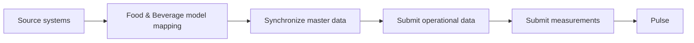

# Food & Beverage

The Food & Beverage model represents manufacturing processes such as dairy, beverages, bakery, meat processing, and prepared foods.

It covers production structure, process batches, production runs, resource consumption, output, cleaning, quality holds, complaints, maintenance, traceability, line states, events, and process measurements.

## What is specific to this model

When integrating Food & Beverage production, pay particular attention to:

- **Batch and lot traceability** for ingredients and other traceable materials.
- **Process measurements** such as temperature, pressure, humidity, pH, and other quality-related values.
- **Resource consumption** for ingredients, packaging, chemicals, utilities, labor, equipment, and other production inputs.
- **Production output and losses** including good output, waste, downgraded product, and rejects.
- **Supplier and lot context** where differences in incoming materials may affect production results.
- **Production-line time accounting** through line states such as breakdowns, cleaning, changeovers, waiting, and reduced-speed operation.

The rest of this section describes how these concepts are represented and submitted to Pulse.

## Excel integration template

For integrations based on file exchange, Pulse provides a [Food & Beverage Excel template](excel-template.md) that can be completed directly by operational users.

The workbook covers master data, production activity, measurements, maintenance, quality, and traceability. Related records are connected through predefined codes and dropdowns, so users can prepare the required data without working directly with the Pulse API model.

## Integration flow



## Before you begin

You need:

- The API base URL assigned to your organization.
- A valid API token.
- Access to the Pulse API reference in Scalar.
- Access to the source data you want to submit.

See [Authentication](../../../getting-started/authentication.md) and [First API request](first-api-request.md).

## Map source data to the Food & Beverage connector

Identify how records from the source system correspond to the resources exposed by the Food & Beverage connector.

Start with stable [master data](master-data/index.md) such as plants, production lines, machines, vessels, products, recipes, materials, suppliers, customers, shifts, crews, lots, clean regimes, reasons, and metrics.

Then map operational records such as [runs](manufacturing/run.md), [batches](manufacturing/batch.md), [stages](manufacturing/stage.md), [consumption](manufacturing/consumption.md), [output](manufacturing/output.md), [readings](manufacturing/reading.md), [line states](manufacturing/line-state.md), [events](manufacturing/event.md), [cleans](manufacturing/clean.md), [holds](manufacturing/hold.md), [complaints](manufacturing/complaint.md), and [maintenance](maintenance/maintenance.md).

Use the resource pages to confirm required fields, dependencies, units, and API paths.

## Submit data in dependency order

Register referenced records before submitting records that depend on them.

A typical order is:

1. Synchronize the required [master data](master-data/index.md).
2. Submit process [batches](manufacturing/batch.md) and their produced lots when applicable.
3. Submit production [runs](manufacturing/run.md).
4. Submit [stages](manufacturing/stage.md) associated with runs.
5. Submit actual [consumption](manufacturing/consumption.md), [output](manufacturing/output.md), and [readings](manufacturing/reading.md).
6. Submit [line states](manufacturing/line-state.md) and [events](manufacturing/event.md) as they occur.
7. Submit [cleans](manufacturing/clean.md), [holds](manufacturing/hold.md), and [maintenance](maintenance/maintenance.md) when those activities are relevant.
8. Submit [complaints](manufacturing/complaint.md) when customer-side quality issues become known.

Food & Beverage API requests reference related records by business code.

See [Relationships](data-model/relationships.md) for shared identity and dependency rules.

## Business codes

Food & Beverage API requests use business codes rather than Pulse numeric identifiers.

For example:

```json
{
  "code": "L03-260810-002",
  "line": "L03",
  "product": "SKU-4471"
}
```

The values of `line` and `product` are the business codes of the referenced production line and product.

The same convention is used throughout the Food & Beverage API.

Pulse may return an internal `id` in responses for support or log correlation, but integrations do not use that `id` as an input.

## Validate and monitor the integration

Before submitting a request:

- Validate the JSON structure.
- Confirm required referenced records exist.
- Use supported enum values.
- Use ISO 8601 timestamps with explicit UTC offsets.
- Use the expected quantity, unit, and value fields.
- Inspect the response before submitting dependent records.

See [Validation](../../../integration/validation.md) and [Updates and error handling](../../../integration/updates-and-error-handling.md).

## Food & Beverage integration areas

| Area | Purpose |
| --- | --- |
| [**Master data**](master-data/index.md) | Stable entities and classifications referenced by operational records. |
| [**Manufacturing**](manufacturing/index.md) | Production runs and batches, stages, resource consumption, output, readings, line states, events, cleaning, quality holds, and complaints. |
| [**Maintenance**](maintenance/index.md) | Preventive and corrective maintenance work, including planned and actual timing and consumed resources. |
| [**Measurements**](measurements.md) | Metric definitions, measured values, setpoints, and other operational readings. |

## Recommended next steps

1. Complete [Authentication](../../../getting-started/authentication.md).
2. Send the [first API request](first-api-request.md).
3. Review the [Food & Beverage data model](data-model/index.md).
4. Follow the [end-to-end Food & Beverage scenario](scenarios/typical-operational-day.md).
5. Use the [API reference](api/index.md) to inspect the required resources and operations.