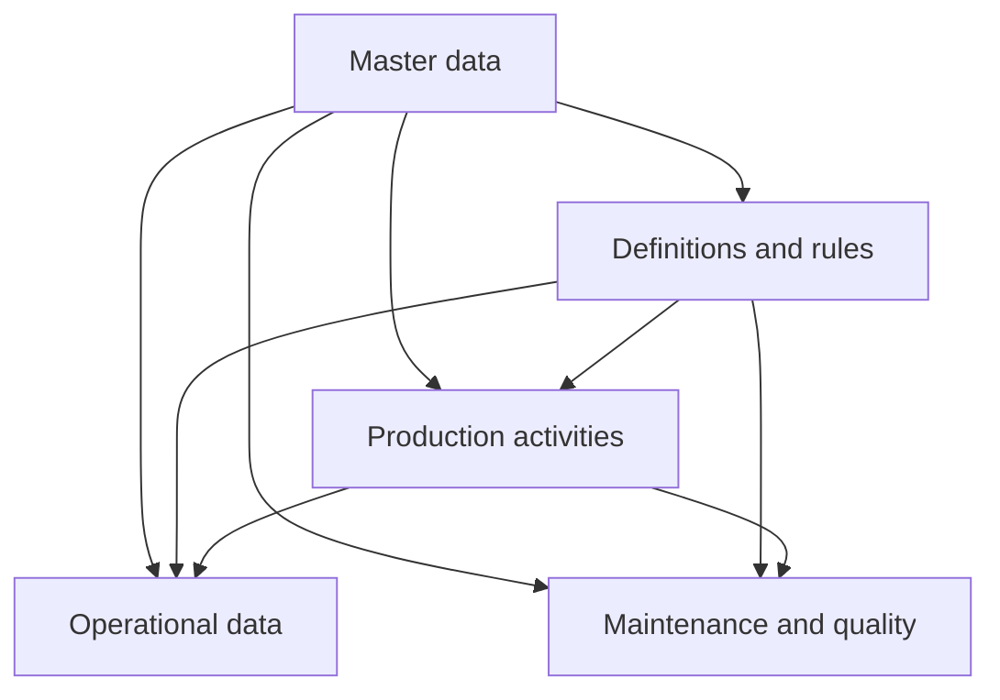

# Food & Beverage

The Food & Beverage model represents manufacturing processes such as dairy, beverages, bakery, meat processing, and prepared foods.

It covers production structure, traceability, bulk processing, production runs, resource use, measurements, cleaning, maintenance, quality, and operational events.

## What is specific to this model

When integrating Food & Beverage production, pay particular attention to:

- **Batch and lot traceability** for incoming materials, bulk production, and finished product.
- **Process measurements and settings** such as temperature, pressure, pH, fill weight, and equipment setpoints.
- **Resource use** for ingredients, packaging, chemicals, utilities, Labor, equipment, and other production inputs.
- **Production output and losses** including good output, waste, downgraded product, and rejects.
- **Supplier and lot context** where incoming-material differences may affect production results.
- **Production-line time accounting** for breakdowns, micro-stops, waiting, maintenance, and other non-running states.
- **Cleaning and changeovers** between products, including expected and actual cleaning duration.
- **Maintenance and quality** through work orders, maintenance resource use, holds, and customer complaints.

## Excel integration template

For integrations based on file exchange, Pulse provides a [Food & Beverage Excel template](excel-template.md) that can be completed directly by operational users.

The workbook covers master data, definitions, production activities, operational data, maintenance, quality, and traceability.

Related records are connected through business codes so users can prepare the required data without working directly with internal Pulse identifiers.

## Integration flow



The exact submission order depends on the source system and the records being integrated. Referenced records must exist before records that depend on them.

## Before you begin

You need:

- The API base URL assigned to your organization.
- A valid API token.
- Access to the Pulse API reference in Scalar.
- Access to the source data you want to submit.

See [Authentication](../../../getting-started/authentication.md) and [First API request](first-api-request.md).

## Map source data to the Food & Beverage model

Start by identifying how records from the source system map to the Food & Beverage resources.

### Master data

Register relatively stable business records such as:

- [Sites](master-data/site.md)
- [Production lines](master-data/production-line.md)
- [Machines](master-data/machine.md)
- [Vessels](master-data/vessel.md)
- [Products](master-data/product.md)
- [Recipes](master-data/recipe.md)
- [Materials](master-data/material.md)
- [Cost lines](master-data/cost-line.md)
- [Suppliers](master-data/supplier.md)
- [Customers](master-data/customer.md)
- [Shifts](master-data/shift.md)
- [Crews](master-data/crew.md)

See [Master data](master-data/index.md).

### Definitions and rules

Define the measurements, specifications, classifications, and operational rules referenced by production data:

- [Measurements](definitions-and-rules/measurement.md)
- [Product limits](definitions-and-rules/product-limit.md)
- [Targets](definitions-and-rules/target.md)
- [Clean regimes](definitions-and-rules/clean-regime.md)
- [Cleaning rules](definitions-and-rules/cleaning-rule.md)
- [Reasons](definitions-and-rules/reason.md)
- [Types](definitions-and-rules/type.md)

See [Definitions and rules](definitions-and-rules/index.md).

### Production activities

Map the production and traceability lifecycle:

- [Lots](production-activities/lot.md)
- [Batches](production-activities/batch.md)
- [Runs](production-activities/run.md)
- [Planned use](production-activities/planned-use.md)
- [Stages](production-activities/stage.md)
- [Cleans](production-activities/clean.md)
- [Holds](production-activities/hold.md)

See [Production activities](production-activities/index.md).

### Operational data

Submit what actually happened during production:

- [Consumption](operational-data/consumption.md)
- [Output](operational-data/output.md)
- [Readings](operational-data/reading.md)
- [Settings](operational-data/setting.md)
- [Line time](operational-data/line-time.md)
- [Events](operational-data/event.md)

See [Operational data](operational-data/index.md).

### Maintenance and quality

Submit maintenance and customer-quality records:

- [Work orders](maintenance-and-quality/work-order.md)
- [Parts and Labor](maintenance-and-quality/parts-and-labor.md)
- [Complaints](maintenance-and-quality/complaint.md)

See [Maintenance and quality](maintenance-and-quality/index.md).

## Business codes

Food & Beverage API requests and references use business codes rather than Pulse internal numeric identifiers.

For example:

```json
{
  "code": "L01-260810-002",
  "line": "LINE001",
  "product": "PRD001"
}
```

`LINE001` and `PRD001` are the business codes of the referenced Production line and Product.

The same convention is used throughout the Food & Beverage API.

## Timestamps

Use ISO 8601 timestamps with an explicit UTC offset where a date and time is required.

For example:

```text
2026-08-10T22:00:00+02:00
```

## Validate the integration

Before submitting data:

- Confirm required referenced records exist.
- Use supported enum values.
- Use the expected business codes.
- Use valid timestamps.
- Use the documented quantity and unit fields.
- Inspect API responses before submitting dependent records.

See [Validation](../../../validation.md) and [Troubleshooting](../../../troubleshooting.md).

## Food & Beverage integration areas

| Area | Purpose |
| --- | --- |
| [**Master data**](master-data/index.md) | Stable business records referenced by other resources. |
| [**Definitions and rules**](definitions-and-rules/index.md) | Measurements, limits, classifications, cleaning rules, and reason codes. |
| [**Production activities**](production-activities/index.md) | Lots, batches, runs, planned use, stages, cleans, and holds. |
| [**Operational data**](operational-data/index.md) | Consumption, output, readings, settings, line time, and events. |
| [**Maintenance and quality**](maintenance-and-quality/index.md) | Work orders, maintenance resource use, and complaints. |

## Recommended next steps

1. Complete [Authentication](../../../getting-started/authentication.md).
2. Send the [First API request](first-api-request.md).
3. Review the [Food & Beverage data model](data-model.md).
4. Follow the [end-to-end Food & Beverage scenario](end-to-end-integration.md).
5. Use the [API reference](api/index.md) to inspect resource paths and operations.