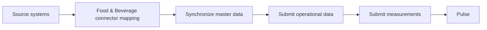

# Food & Beverage integration

This section describes the Pulse Food & Beverage connector model.

The connector maps Food & Beverage concepts, including plants, production lines, batches, stages, resource plans and usage, output, downtime, waste, maintenance, traceability, and measurements, into the shared internal Pulse data model.

Other connector models may use different terminology and mappings depending on their operational context.

## Integration flow

## Before you begin

You need:

- The API base URL assigned to your organization.
- A valid API token.
- Access to the Pulse API reference in Scalar.
- Access to the source data you want to submit.

See [Authentication](../../../getting-started/authentication.md) and [First API request](first-api-request.md).

## Map source data to the Food & Beverage connector

Identify how records from the source system correspond to the entities exposed by the Food & Beverage connector.

Start with stable master data such as plants, production lines, products, materials, equipment, labor, shifts, and measure units. Then map operational records such as batches, stages, plans, usage, output, downtime, waste, maintenance, and measurements.

Use the entity pages to confirm required attributes, references, units, and API paths.

## Submit data in dependency order

Create or retrieve parent records before submitting records that reference them.

A typical order is:

1. Synchronize the required [master data](master-data/index.md).
2. Create the main operational record.
3. Create its dependent records.
4. Submit planned data.
5. Submit actual usage and output.
6. Submit downtime, waste, maintenance, and measurements as applicable.

See [Relationships](data-model/relationships.md) for shared identity and dependency rules.

## Resolve identifiers

Pulse records use integer `id` values.

When a source record has a stable business `code`, retrieve the Pulse record by `code` and use the returned `id` in related requests.

Do not maintain a permanent source-system mapping between `code` and Pulse `id`.

## Validate and monitor the integration

Before submitting a request:

- Validate the JSON structure.
- Confirm required records exist.
- Use supported enum values.
- Use consistent timestamps and time zones.
- Use the expected quantity and price units.
- Inspect the response before submitting dependent records.

See [Validation](../../../integration/validation.md) and [Updates and error handling](../../../integration/updates-and-error-handling.md).

## Food & Beverage integration areas

| Area | Purpose |
| --- | --- |
| [**Master data**](master-data/index.md) | Stable entities and classifications referenced by operational records. |
| [**Manufacturing**](manufacturing/index.md) | Planned and actual operational activity, resources, output, downtime, and waste. |
| [**Maintenance**](maintenance/index.md) | Preventive and corrective maintenance plans, execution, resources, and costs. |
| [**Traceability**](traceability/lot.md) | Traceable lots referenced by applicable usage records. |
| [**Measurements**](measurements.md) | Measured operational values submitted as Ambient value records. |

## Recommended next steps

1. Complete [Authentication](../../../getting-started/authentication.md).
2. Send the [first API request](first-api-request.md).
3. Review the [Food & Beverage data model](data-model/index.md).
4. Follow the [end-to-end Food & Beverage scenario](scenarios/typical-operational-day.md).
5. Use the [API reference](api/index.md) to inspect the required services.
