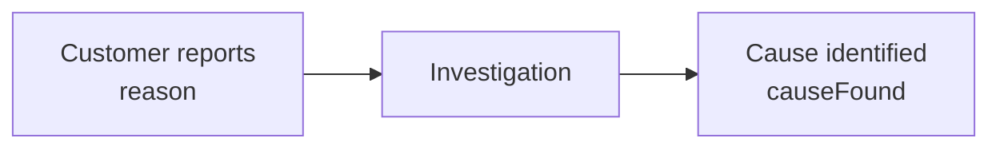

# Complaint

Represents a customer complaint associated with a Product and a traceable finished Lot.

A Complaint records what the customer reported, when they noticed the issue, when the complaint reached the producer, and how the investigation was resolved.

## The Complaint object

```json
{
  "code": "CMP-2026-0413",
  "customer": "CUS001",
  "lot": "FG-260810-113",
  "product": "PRD001",
  "reason": "CMP-FOREIGN-BODY",
  "detail": "Blue plastic fragment about 4mm in the cup",
  "quantity": 6,
  "unit": "pcs",
  "severity": 4,
  "noticedAt": "2026-08-19T12:00:00+02:00",
  "heardAt": "2026-08-24T09:12:00+02:00",
  "outcome": "upheld",
  "settlement": "credit",
  "cost": 184.5,
  "causeFound": "CMP-FOREIGN-BODY",
  "settledAt": "2026-09-02T14:00:00+02:00"
}
```

## Fields

<div class="attributes-table" markdown>

| Field | Type | Description | Example |
| --- | --- | --- | --- |
| `code` | string | Unique business code used to identify the Complaint. | `"CMP-2026-0413"` |
| [`customer`](../master-data/customer.md) | string | Business code of the Customer associated with the Complaint. | `"CUS001"` |
| [`lot`](../production-activities/lot.md) | string | Business code of the affected finished Lot. The Lot must have been produced by a Run. | `"FG-260810-113"` |
| [`product`](../master-data/product.md) | string | Business code of the affected Product. | `"PRD001"` |
| [`reason`](../definitions-and-rules/reason.md) | string | Business code of the Reason describing what the customer reported. | `"CMP-FOREIGN-BODY"` |
| `detail` | string or null | Optional free-text description of the reported issue. | `"Blue plastic fragment about 4mm in the cup"` |
| `quantity` | number or null | Optional affected quantity. | `6` |
| `unit` | string or null | Unit in which the affected quantity is expressed. | `"pcs"` |
| `severity` | integer or null | Optional severity from `1` to `5`. | `4` |
| `noticedAt` | string | Date and time when the customer noticed the issue, in ISO 8601 format. | `"2026-08-19T12:00:00+02:00"` |
| `heardAt` | string | Date and time when the complaint reached the producer, in ISO 8601 format. | `"2026-08-24T09:12:00+02:00"` |
| `outcome` | string or null | Investigation outcome. Supported values are `upheld`, `rejected`, and `goodwill`. | `"upheld"` |
| `settlement` | string or null | Commercial resolution. Supported values are `credit`, `replacement`, `collection`, and `none`. | `"credit"` |
| `cost` | number or null | Optional cost associated with resolving the Complaint. | `184.5` |
| [`causeFound`](../definitions-and-rules/reason.md) | string or null | Optional business code of the Reason established by the investigation. | `"CMP-FOREIGN-BODY"` |
| `settledAt` | string or null | Date and time when the Complaint was settled, or `null` while it remains open. | `"2026-09-02T14:00:00+02:00"` |

</div>

> [!IMPORTANT]
> `code` must be unique. Two Complaints cannot use the same code.
>
> `customer`, `lot`, `product`, and `reason` must reference existing records.
>
> The referenced `lot` must be a finished Lot produced by a Run.
>
> When `causeFound` is provided, it must reference an existing Reason.
>
> Both `noticedAt` and `heardAt` are required.

## Reported reason and cause found

`reason` and `causeFound` describe two different facts.

`reason` records what the customer reported.

`causeFound` records what the investigation later determined.



For example, the customer may report a sealing problem while the investigation later identifies a different underlying cause.

Keeping the two fields separate preserves the distinction between the reported symptom and the cause established during investigation.

## Complaint timing

A Complaint has two required timestamps describing different moments.

`noticedAt` records when the customer noticed the issue.

`heardAt` records when the producer learned about it.

```text
Customer notices issue        Producer receives complaint
        19 Aug                        24 Aug
          │                             │
          └──────── 5 days ─────────────┘
```

The difference between these timestamps preserves the delay between the customer's observation and receipt of the Complaint.

## Complaint lifecycle

A Complaint can be recorded before the investigation is complete:

```json
{
  "code": "CMP-2026-0413",
  "customer": "CUS001",
  "lot": "FG-260810-113",
  "product": "PRD001",
  "reason": "CMP-FOREIGN-BODY",
  "noticedAt": "2026-08-19T12:00:00+02:00",
  "heardAt": "2026-08-24T09:12:00+02:00"
}
```

While `settledAt` is null, the Complaint remains open.

When the investigation and commercial handling are complete, settlement details can be added:

```json
{
  "outcome": "upheld",
  "settlement": "credit",
  "cost": 184.5,
  "causeFound": "CMP-FOREIGN-BODY",
  "settledAt": "2026-09-02T14:00:00+02:00"
}
```

```text
settledAt = null    → open
settledAt supplied  → settled
```

## Outcome

Supported `outcome` values are:

| Outcome | Meaning |
| --- | --- |
| `upheld` | The Complaint was substantiated. |
| `rejected` | The Complaint was not substantiated. |
| `goodwill` | The Complaint was resolved as a goodwill gesture without accepting liability. |

`outcome` is optional and can remain null while the investigation is undecided.

## Settlement

Supported `settlement` values are:

| Settlement | Meaning |
| --- | --- |
| `credit` | The Customer received a credit. |
| `replacement` | The affected Product was replaced. |
| `collection` | The affected Product was collected. |
| `none` | No commercial settlement was made. |

`settlement` is optional and can remain null while the Complaint is unsettled.

## Traceability

The finished Lot connects the Complaint to its production context.

Pulse resolves the Run that produced the Lot and the Production line associated with that Run.


This preserves production traceability without requiring the Complaint payload to submit the Run or Production line directly.

## Reference protection

A Customer, Product, Lot, or Reason referenced by an existing Complaint cannot be deleted while the Complaint still references it.

This also applies to the optional Reason referenced by `causeFound`.

## API resource

| Resource | Base path |
| --- | --- |
| `Complaint` | `/services/pulse/food-beverage/complaints` |

## API methods

### Create a complaint

`POST /services/pulse/food-beverage/complaints/insert`

Creates a customer Complaint.

#### Request

```http
POST /services/pulse/food-beverage/complaints/insert
Content-Type: application/json
```

```json
{
  "code": "CMP-2026-0413",
  "customer": "CUS001",
  "lot": "FG-260810-113",
  "product": "PRD001",
  "reason": "CMP-FOREIGN-BODY",
  "detail": "Blue plastic fragment about 4mm in the cup",
  "quantity": 6,
  "unit": "pcs",
  "severity": 4,
  "noticedAt": "2026-08-19T12:00:00+02:00",
  "heardAt": "2026-08-24T09:12:00+02:00",
  "outcome": "upheld",
  "settlement": "credit",
  "cost": 184.5,
  "causeFound": "CMP-FOREIGN-BODY",
  "settledAt": "2026-09-02T14:00:00+02:00"
}
```

#### Parameters

| Parameter | Type | Required | Description |
| --- | --- | --- | --- |
| `code` | string | yes | Unique business code of the Complaint. |
| `customer` | string | yes | Business code of the Customer. |
| `lot` | string | yes | Business code of the affected finished Lot. |
| `product` | string | yes | Business code of the affected Product. |
| `reason` | string | yes | Business code describing what the Customer reported. |
| `detail` | string or null | no | Additional free-text description. |
| `quantity` | number or null | no | Affected quantity. |
| `unit` | string or null | no | Unit of the affected quantity. |
| `severity` | integer or null | no | Severity from `1` to `5`. |
| `noticedAt` | string | yes | Date and time when the Customer noticed the issue. |
| `heardAt` | string | yes | Date and time when the Complaint reached the producer. |
| `outcome` | string or null | no | `upheld`, `rejected`, or `goodwill`. |
| `settlement` | string or null | no | `credit`, `replacement`, `collection`, or `none`. |
| `cost` | number or null | no | Cost associated with the Complaint. |
| `causeFound` | string or null | no | Business code of the Reason established by the investigation. |
| `settledAt` | string or null | no | Date and time when the Complaint was settled. |

### Update a complaint

`PUT /services/pulse/food-beverage/complaints/update`

Updates an existing Complaint identified by its business `code`.

#### Request

```http
PUT /services/pulse/food-beverage/complaints/update
Content-Type: application/json
```

```json
{
  "code": "CMP-2026-0413",
  "customer": "CUS001",
  "lot": "FG-260810-113",
  "product": "PRD001",
  "reason": "CMP-FOREIGN-BODY",
  "detail": "Blue plastic fragment about 4mm in the cup",
  "quantity": 6,
  "unit": "pcs",
  "severity": 4,
  "noticedAt": "2026-08-19T12:00:00+02:00",
  "heardAt": "2026-08-24T09:12:00+02:00",
  "outcome": "upheld",
  "settlement": "credit",
  "cost": 184.5,
  "causeFound": "CMP-FOREIGN-BODY",
  "settledAt": "2026-09-02T14:00:00+02:00"
}
```

### Patch a complaint

`PATCH /services/pulse/food-beverage/complaints/patch`

Partially updates an existing Complaint.

The Complaint is identified by `properties.code`. Fields omitted from `properties` keep their current values.

Nullable fields can be explicitly cleared by including them with a null value.

#### Request

```http
PATCH /services/pulse/food-beverage/complaints/patch
Content-Type: application/json
```

```json
{
  "properties": {
    "code": "CMP-2026-0413",
    "outcome": "upheld",
    "settlement": "credit",
    "cost": 184.5,
    "causeFound": "CMP-FOREIGN-BODY",
    "settledAt": "2026-09-02T14:00:00+02:00"
  }
}
```

#### Parameters

| Parameter | Type | Required | Description |
| --- | --- | --- | --- |
| `properties` | object | yes | Fields included in the partial update. |
| `properties.code` | string | yes | Business code of the Complaint to update. |
| `properties.customer` | string | no | New Customer business code. |
| `properties.lot` | string | no | New finished-Lot business code. |
| `properties.product` | string | no | New Product business code. |
| `properties.reason` | string | no | New reported Reason business code. |
| `properties.detail` | string or null | no | New detail, or `null` to clear it. |
| `properties.quantity` | number or null | no | New affected quantity, or `null` to clear it. |
| `properties.unit` | string or null | no | New quantity unit, or `null` to clear it. |
| `properties.severity` | integer or null | no | New severity, or `null` to clear it. |
| `properties.noticedAt` | string | no | New date and time when the issue was noticed. |
| `properties.heardAt` | string | no | New date and time when the Complaint was received. |
| `properties.outcome` | string or null | no | New investigation outcome, or `null` to clear it. |
| `properties.settlement` | string or null | no | New commercial settlement, or `null` to clear it. |
| `properties.cost` | number or null | no | New Complaint cost, or `null` to clear it. |
| `properties.causeFound` | string or null | no | New found-cause Reason code, or `null` to clear it. |
| `properties.settledAt` | string or null | no | New settlement timestamp, or `null` to reopen the Complaint. |

### Retrieve a complaint

`GET /services/pulse/food-beverage/complaints/select`

Returns the Complaint identified by its business code.

#### Request

```http
GET /services/pulse/food-beverage/complaints/select?id=CMP-2026-0413
```

#### Parameters

| Parameter | Type | Required | Description |
| --- | --- | --- | --- |
| `id` | string | yes | Business code of the Complaint to retrieve. |

#### Example response

```json
{
  "code": "CMP-2026-0413",
  "customer": "CUS001",
  "lot": "FG-260810-113",
  "product": "PRD001",
  "reason": "CMP-FOREIGN-BODY",
  "detail": "Blue plastic fragment about 4mm in the cup",
  "quantity": 6,
  "unit": "pcs",
  "severity": 4,
  "noticedAt": "2026-08-19T12:00:00+02:00",
  "heardAt": "2026-08-24T09:12:00+02:00",
  "outcome": "upheld",
  "settlement": "credit",
  "cost": 184.5,
  "causeFound": "CMP-FOREIGN-BODY",
  "settledAt": "2026-09-02T14:00:00+02:00"
}
```

### List complaints

`GET /services/pulse/food-beverage/complaints/query`

Returns Complaints matching the supplied filters.

#### Request

```http
GET /services/pulse/food-beverage/complaints/query?customers=CUS001&products=PRD001&reasons=CMP-FOREIGN-BODY
```

#### Query parameters

| Parameter | Type | Required | Description |
| --- | --- | --- | --- |
| `codes` | string or array of strings | no | Limits results to the specified Complaint business codes. |
| `customers` | string or array of strings | no | Limits results to Complaints from the specified Customers. |
| `products` | string or array of strings | no | Limits results to Complaints for the specified Products. |
| `reasons` | string or array of strings | no | Limits results to Complaints with the specified reported Reasons. |
| `from` | string | no | Earliest `heardAt` timestamp to include. |
| `to` | string | no | Latest `heardAt` timestamp to include. |

Multiple values can be supplied by repeating the query parameter:

```http
GET /services/pulse/food-beverage/complaints/query?products=PRD001&products=PRD002
```

### Delete a complaint

`DELETE /services/pulse/food-beverage/complaints/delete`

Deletes the Complaint identified by its business code.

Use this only when the Complaint record itself should not exist.

#### Request

```http
DELETE /services/pulse/food-beverage/complaints/delete?id=CMP-2026-0413
```

#### Parameters

| Parameter | Type | Required | Description |
| --- | --- | --- | --- |
| `id` | string | yes | Business code of the Complaint to delete. |