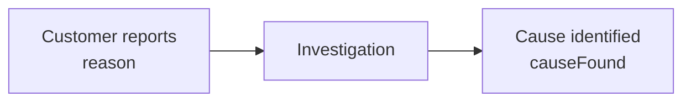
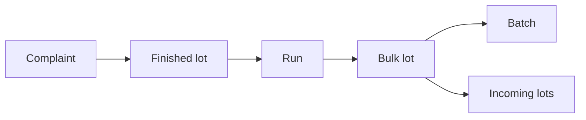

# Complaint

<!-- TODO: This page is currently based on ApiSurfaceRevised. Revisit it once the implementation is available and verify fields, routes, query parameters, PATCH behavior, maturity behavior, and examples against the current code. -->

Represents a customer complaint associated with a product and traceable finished lot.

A complaint records what the customer reported, when they noticed the issue, when the complaint reached the plant, and how the investigation was resolved.

## The Complaint object

```json
{
  "code": "CMP-2026-0413",
  "customer": "CUS001",
  "lot": "FG-260810-113",
  "product": "PRD001",
  "reason": "CMP-FOREIGN-BODY",
  "detail": "Blue plastic fragment about 4mm in the cup",
  "quantity": 6,
  "unit": "pcs",
  "severity": 4,
  "noticedAt": "2026-08-19",
  "heardAt": "2026-08-24T09:12:00+02:00",
  "outcome": "upheld",
  "settlement": "credit",
  "cost": 184.5,
  "causeFound": "CMP-FOREIGN-BODY",
  "settledAt": "2026-09-02T14:00:00+02:00"
}
```

## Fields

<div class="attributes-table" markdown>

| Field | Type | Description | Example |
| --- | --- | --- | --- |
| `code` | string | Unique business code used to identify the complaint. | `"CMP-2026-0413"` |
| [`customer`](../master-data/customer.md) | string | Business code of the customer associated with the complaint. | `"CUS001"` |
| [`lot`](../production-activities/lot.md) | string | Business code of the affected finished lot. | `"FG-260810-113"` |
| [`product`](../master-data/product.md) | string | Business code of the affected product. | `"PRD001"` |
| [`reason`](../definitions-and-rules/reason.md) | string | Business code of the reason describing what the customer reported. | `"CMP-FOREIGN-BODY"` |
| `detail` | string or null | Optional free-text description of the reported issue. | `"Blue plastic fragment about 4mm in the cup"` |
| `quantity` | number or null | Optional affected quantity. | `6` |
| `unit` | string or null | Unit in which the affected quantity is expressed. | `"pcs"` |
| `severity` | integer or null | Optional severity of the complaint. | `4` |
| `noticedAt` | string | Date or time when the customer noticed the issue. | `"2026-08-19"` |
| `heardAt` | string | Date and time when the complaint reached the plant. | `"2026-08-24T09:12:00+02:00"` |
| `outcome` | string or null | Outcome of the investigation. Supported values are `upheld`, `rejected`, and `goodwill`. | `"upheld"` |
| `settlement` | string or null | Commercial resolution. Supported values are `credit`, `replacement`, `collection`, and `none`. | `"credit"` |
| `cost` | number or null | Optional cost associated with resolving the complaint. | `184.5` |
| [`causeFound`](../definitions-and-rules/reason.md) | string or null | Business code of the cause identified during investigation. | `"CMP-FOREIGN-BODY"` |
| `settledAt` | string or null | Optional date and time when the complaint was settled. | `"2026-09-02T14:00:00+02:00"` |

</div>

> [!IMPORTANT]
> `code` must be unique.
>
> `customer`, `lot`, `product`, and `reason` must reference existing records.
>
> Both `noticedAt` and `heardAt` are required.

## Reported reason and cause found

`reason` and `causeFound` describe two different facts.

`reason` records what the customer reported.

`causeFound` records what the investigation later determined.



For example, the customer may report a sealing problem while the investigation later finds an incorrect machine setting.

Keeping the two fields separate preserves the difference between the observed symptom and the identified cause.

## Complaint timing

A complaint has two required timestamps describing different moments.

`noticedAt` records when the customer noticed the problem.

`heardAt` records when the plant learned about it.

```text
Customer notices issue        Plant receives complaint
        19 Aug                       24 Aug
          │                            │
          └──────── 5 days ────────────┘
```

The gap between these timestamps describes how long it took for the issue to reach the plant.

This matters because complaints may arrive well after the production activity that caused them.

## Complaint lifecycle

A complaint can be recorded before the investigation is complete:

```json
{
  "code": "CMP-2026-0413",
  "customer": "CUS001",
  "lot": "FG-260810-113",
  "product": "PRD001",
  "reason": "CMP-FOREIGN-BODY",
  "noticedAt": "2026-08-19",
  "heardAt": "2026-08-24T09:12:00+02:00"
}
```

When the investigation is completed, the outcome can be added:

```json
{
  "code": "CMP-2026-0413",
  "outcome": "upheld",
  "settlement": "credit",
  "cost": 184.5,
  "causeFound": "CMP-FOREIGN-BODY",
  "settledAt": "2026-09-02T14:00:00+02:00"
}
```

## Outcome

Supported `outcome` values are:

| Outcome | Meaning |
| --- | --- |
| `upheld` | The complaint was confirmed. |
| `rejected` | The complaint was not confirmed. |
| `goodwill` | A commercial resolution was provided without confirming the complaint. |

## Settlement

Supported `settlement` values are:

| Settlement | Meaning |
| --- | --- |
| `credit` | A financial credit was issued. |
| `replacement` | Replacement product was provided. |
| `collection` | Product was collected or returned. |
| `none` | No commercial settlement was required. |

## Traceability

The finished lot links the complaint back to the production history that created the affected product.



This allows complaint patterns to be analysed against production context without requiring the complaint payload to reference the historical Run directly.

## Late-arriving complaints

Complaints often arrive days or weeks after production.

This means recent production periods may not yet contain all complaints that will eventually be reported.

The complaint read surface may therefore include a `maturity` indicator for recent periods so that incomplete complaint data is not interpreted as an improvement.

The exact response shape of the maturity marker should be verified against the implementation.

## API resource

| Resource | Base path |
| --- | --- |
| `Complaint` | `/services/pulse/food-beverage/complaints` |

## API methods

> [!NOTE]
> The API methods below follow the current Food & Beverage service pattern and are provisional until the Complaints implementation is available for verification.

### Create a complaint

`POST /services/pulse/food-beverage/complaints/insert`

Creates a customer complaint.

#### Request

```http
POST /services/pulse/food-beverage/complaints/insert
Content-Type: application/json
```

```json
{
  "code": "CMP-2026-0413",
  "customer": "CUS001",
  "lot": "FG-260810-113",
  "product": "PRD001",
  "reason": "CMP-FOREIGN-BODY",
  "detail": "Blue plastic fragment about 4mm in the cup",
  "quantity": 6,
  "unit": "pcs",
  "severity": 4,
  "noticedAt": "2026-08-19",
  "heardAt": "2026-08-24T09:12:00+02:00",
  "outcome": "upheld",
  "settlement": "credit",
  "cost": 184.5,
  "causeFound": "CMP-FOREIGN-BODY",
  "settledAt": "2026-09-02T14:00:00+02:00"
}
```

#### Parameters

| Parameter | Type | Required | Description |
| --- | --- | --- | --- |
| `code` | string | yes | Unique business code of the complaint. |
| `customer` | string | yes | Business code of the customer. |
| `lot` | string | yes | Business code of the affected finished lot. |
| `product` | string | yes | Business code of the affected product. |
| `reason` | string | yes | Business code describing what the customer reported. |
| `detail` | string or null | no | Additional free-text description. |
| `quantity` | number or null | no | Affected quantity. |
| `unit` | string or null | no | Unit of the affected quantity. |
| `severity` | integer or null | no | Complaint severity. |
| `noticedAt` | string | yes | When the customer noticed the issue. |
| `heardAt` | string | yes | When the plant received the complaint. |
| `outcome` | string or null | no | `upheld`, `rejected`, or `goodwill`. |
| `settlement` | string or null | no | `credit`, `replacement`, `collection`, or `none`. |
| `cost` | number or null | no | Cost associated with the complaint. |
| `causeFound` | string or null | no | Business code of the cause found during investigation. |
| `settledAt` | string or null | no | When the complaint was settled. |


### Update a complaint

`PUT /services/pulse/food-beverage/complaints/update`

Updates an existing complaint.

### Patch a complaint

`PATCH /services/pulse/food-beverage/complaints/patch`

Partially updates an existing complaint.

The fields to update are supplied in the `properties` object. The complaint is identified by its business `code`.

#### Request

```http
PATCH /services/pulse/food-beverage/complaints/patch
Content-Type: application/json
```

```json
{
  "properties": {
    "code": "CMP-2026-0413",
    "outcome": "upheld",
    "settlement": "credit",
    "cost": 184.5,
    "causeFound": "CMP-FOREIGN-BODY",
    "settledAt": "2026-09-02T14:00:00+02:00"
  }
}
```


### Retrieve a complaint

`GET /services/pulse/food-beverage/complaints/select`

Returns the complaint identified by its business code.

#### Request

```http
GET /services/pulse/food-beverage/complaints/select?id=CMP-2026-0413
```


### List complaints

`GET /services/pulse/food-beverage/complaints/query`

Returns complaints matching the supplied filters.

#### Request

```http
GET /services/pulse/food-beverage/complaints/query?customer=CUS001&product=PRD001&reason=CMP-FOREIGN-BODY
```

#### Query parameters

| Parameter | Type | Required | Description |
| --- | --- | --- | --- |
| `customer` | string | no | Limits results to complaints from the specified customer. |
| `product` | string | no | Limits results to complaints for the specified product. |
| `reason` | string | no | Limits results to complaints with the specified reported reason. |
| `from` | string | no | Limits results to complaints received on or after the specified date or time. |
| `to` | string | no | Limits results to complaints received on or before the specified date or time. |


### Delete a complaint

`DELETE /services/pulse/food-beverage/complaints/delete`

Deletes the complaint identified by its business code.

#### Request

```http
DELETE /services/pulse/food-beverage/complaints/delete?id=CMP-2026-0413
```