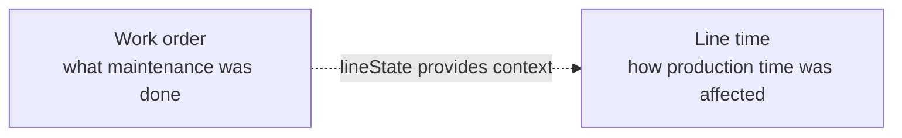

# Work order

<!-- TODO: This page is currently based on ApiSurfaceRevised. Revisit it once the implementation is available and verify fields, routes, query parameters, PATCH behavior, and examples against the current code. -->

Represents preventive or corrective maintenance work performed on equipment.

A work order records what equipment was maintained, whether the work addressed a failure, the planned and actual maintenance window, and any associated reason.

## The Work order object

```json
{
  "code": "WO-8842",
  "equipment": "EQ010",
  "fixingFailure": true,
  "reason": "Worn filler seal, deferred to shutdown",
  "plannedStart": "2026-08-23T06:00:00+02:00",
  "plannedEnd": "2026-08-23T09:00:00+02:00",
  "start": "2026-08-23T06:05:00+02:00",
  "end": "2026-08-23T08:40:00+02:00",
  "lineState": "planned-maintenance"
}
```

## Fields

<div class="attributes-table" markdown>

| Field | Type | Description | Example |
| --- | --- | --- | --- |
| `code` | string | Unique business code used to identify the work order. | `"WO-8842"` |
| [`equipment`](../master-data/machine.md) | string | Business code of the machine, component, or wear part being maintained. | `"EQ010"` |
| `fixingFailure` | boolean | `true` when the work fixes an existing or imminent failure; otherwise `false`. | `true` |
| [`reason`](../definitions-and-rules/reason.md) | string or null | Optional registered Reason code or free-text explanation. | `"MNT-SEAL-WEAR"` |
| `plannedStart` | string or null | Optional planned start of the maintenance window. | `"2026-08-23T06:00:00+02:00"` |
| `plannedEnd` | string or null | Optional planned end of the maintenance window. | `"2026-08-23T09:00:00+02:00"` |
| `start` | string | Date and time when maintenance actually started. | `"2026-08-23T06:05:00+02:00"` |
| `end` | string or null | Optional date and time when maintenance actually finished. | `"2026-08-23T08:40:00+02:00"` |
| `lineState` | string or null | Optional Line time state that the connector should submit if this work stopped the production line. | `"planned-maintenance"` |

</div>

> [!IMPORTANT]
> `code` must be unique.
>
> `equipment` must reference an existing Machine or equipment component.

## Corrective and preventive work

`fixingFailure` describes the nature of the maintenance work.

| Value | Meaning |
| --- | --- |
| `true` | Corrective work that addresses an existing or imminent failure. |
| `false` | Preventive work intended to avoid failure. |

This is independent of whether the maintenance was planned.

For example, a known failed seal may be repaired during a scheduled shutdown:

```json
{
  "fixingFailure": true,
  "plannedStart": "2026-08-23T06:00:00+02:00",
  "plannedEnd": "2026-08-23T09:00:00+02:00"
}
```

The work is corrective because it fixes a failure, but planned because it has a planned maintenance window.

## Planned and unplanned work

The presence of a planned window determines whether the work was planned.

```text
plannedStart + plannedEnd present
→ planned work

no planned window
→ unplanned work
```

There is no separate `planned` or `unplanned` flag.

This keeps two different questions separate:

```text
What kind of work was it?
→ fixingFailure

Was it scheduled in advance?
→ planned window
```

## Equipment

Where possible, `equipment` should identify the specific component or wear part being maintained rather than only its parent machine.

For example:

```text
Filler
└── Filling head
    └── Seal
```

Identifying the most specific maintained component allows maintenance history to be associated with the part whose operating life is actually affected.

## Work order and line time

A Work order describes maintenance activity.

[Line time](../operational-data/line-time.md) describes how that activity affected production-line availability.

`lineState` does not itself create a Line time record.

For example:

```json
{
  "lineState": "planned-maintenance"
}
```

tells the connector which state should be submitted separately to `/line-time` when the maintenance stopped production.



A maintenance activity may therefore exist without any corresponding Line time interval if production continued normally.

## API resource

| Resource | Base path |
| --- | --- |
| `Work order` | `/services/pulse/food-beverage/work-orders` |

## API methods

> [!NOTE]
> The API methods below follow the current Food & Beverage service pattern and are provisional until the Work orders implementation is available for verification.

### Create a work order

`POST /services/pulse/food-beverage/work-orders/insert`

Creates a maintenance work order.

#### Request

```http
POST /services/pulse/food-beverage/work-orders/insert
Content-Type: application/json
```

```json
{
  "code": "WO-8842",
  "equipment": "EQ010",
  "fixingFailure": true,
  "reason": "Worn filler seal, deferred to shutdown",
  "plannedStart": "2026-08-23T06:00:00+02:00",
  "plannedEnd": "2026-08-23T09:00:00+02:00",
  "start": "2026-08-23T06:05:00+02:00",
  "end": "2026-08-23T08:40:00+02:00",
  "lineState": "planned-maintenance"
}
```

#### Parameters

| Parameter | Type | Required | Description |
| --- | --- | --- | --- |
| `code` | string | yes | Unique business code of the work order. |
| `equipment` | string | yes | Business code of the maintained equipment. |
| `fixingFailure` | boolean | yes | Whether the work addresses an existing or imminent failure. |
| `reason` | string or null | no | Registered Reason code or free-text explanation. |
| `plannedStart` | string or null | no | Planned maintenance start. |
| `plannedEnd` | string or null | no | Planned maintenance end. |
| `start` | string | yes | Actual maintenance start. |
| `end` | string or null | no | Actual maintenance end. |
| `lineState` | string or null | no | Line time state to submit separately when production was stopped. |


### Update a work order

`PUT /services/pulse/food-beverage/work-orders/update`

Updates an existing work order.

#### Request

```http
PUT /services/pulse/food-beverage/work-orders/update
Content-Type: application/json
```

```json
{
  "code": "WO-8842",
  "equipment": "EQ010",
  "fixingFailure": true,
  "reason": "Worn filler seal, deferred to shutdown",
  "plannedStart": "2026-08-23T06:00:00+02:00",
  "plannedEnd": "2026-08-23T09:00:00+02:00",
  "start": "2026-08-23T06:05:00+02:00",
  "end": "2026-08-23T08:45:00+02:00",
  "lineState": "planned-maintenance"
}
```


### Patch a work order

`PATCH /services/pulse/food-beverage/work-orders/patch`

Partially updates an existing work order.

The fields to update are supplied in the `properties` object. The work order is identified by its business `code`.

#### Request

```http
PATCH /services/pulse/food-beverage/work-orders/patch
Content-Type: application/json
```

```json
{
  "properties": {
    "code": "WO-8842",
    "end": "2026-08-23T08:45:00+02:00"
  }
}
```


### Retrieve a work order

`GET /services/pulse/food-beverage/work-orders/select`

Returns the work order identified by its business code.

#### Request

```http
GET /services/pulse/food-beverage/work-orders/select?id=WO-8842
```

#### Parameters

| Parameter | Type | Required | Description |
| --- | --- | --- | --- |
| `id` | string | yes | Business code of the work order to retrieve. |


### List work orders

`GET /services/pulse/food-beverage/work-orders/query`

Returns work orders matching the supplied filters.

#### Request

```http
GET /services/pulse/food-beverage/work-orders/query?equipment=EQ010&fixingFailure=true
```

#### Query parameters

| Parameter | Type | Required | Description |
| --- | --- | --- | --- |
| `equipment` | string | no | Limits results to work orders for the specified equipment. |
| `fixingFailure` | boolean | no | Limits results to corrective or preventive work. |
| `from` | string | no | Limits results to work orders starting on or after the specified date or time. |
| `to` | string | no | Limits results to work orders starting on or before the specified date or time. |


### Delete a work order

`DELETE /services/pulse/food-beverage/work-orders/delete`

Deletes the work order identified by its business code.

#### Request

```http
DELETE /services/pulse/food-beverage/work-orders/delete?id=WO-8842
```

#### Parameters

| Parameter | Type | Required | Description |
| --- | --- | --- | --- |
| `id` | string | yes | Business code of the work order to delete. |