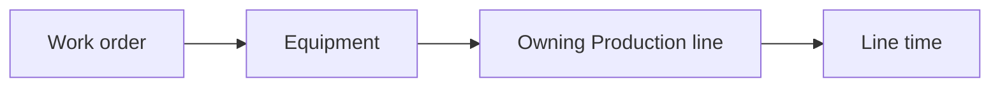

# Work order

Represents preventive or corrective maintenance work performed on equipment.

A Work order records what equipment was maintained, whether the work addressed a failure, the planned and actual maintenance window, and any associated reason.

## The Work order object

```json
{
  "code": "WO-8842",
  "equipment": "EQ010",
  "fixingFailure": true,
  "reason": "MNT-SEAL-WEAR",
  "plannedStart": "2026-08-23T06:00:00+02:00",
  "plannedEnd": "2026-08-23T09:00:00+02:00",
  "start": "2026-08-23T06:05:00+02:00",
  "end": "2026-08-23T08:40:00+02:00",
  "lineState": "planned-maintenance"
}
```

## Fields

<div class="attributes-table" markdown>

| Field | Type | Description | Example |
| --- | --- | --- | --- |
| `code` | string | Unique business code used to identify the Work order. | `"WO-8842"` |
| [`equipment`](../master-data/machine.md) | string | Business code of the Machine or equipment component being maintained. | `"EQ010"` |
| `fixingFailure` | boolean | `true` for corrective work that addresses an existing or imminent failure; otherwise `false`. | `true` |
| [`reason`](../definitions-and-rules/reason.md) | string or null | Optional registered Reason code or free-text explanation. | `"MNT-SEAL-WEAR"` |
| `plannedStart` | string or null | Optional planned start of the maintenance window. | `"2026-08-23T06:00:00+02:00"` |
| `plannedEnd` | string or null | Optional planned end of the maintenance window. | `"2026-08-23T09:00:00+02:00"` |
| `start` | string | Date and time when maintenance actually started, in ISO 8601 format. | `"2026-08-23T06:05:00+02:00"` |
| `end` | string or null | Date and time when maintenance actually finished, or `null` while the Work order remains open. | `"2026-08-23T08:40:00+02:00"` |
| `lineState` | string or null | Optional Line time condition to record for the owning Production line while this maintenance work is active. | `"planned-maintenance"` |

</div>

> [!IMPORTANT]
> `code` must be unique. Two Work orders cannot use the same code.
>
> `equipment` must reference an existing Machine or equipment component.
>
> Once created, a Work order cannot be changed from corrective to preventive or vice versa.

## Corrective and preventive work

`fixingFailure` describes the nature of the maintenance work.

| Value | Meaning |
| --- | --- |
| `true` | Corrective work that addresses an existing or imminent failure. |
| `false` | Preventive work intended to avoid failure. |

This is independent of whether the work was scheduled in advance.

For example:

```json
{
  "fixingFailure": true,
  "plannedStart": "2026-08-23T06:00:00+02:00",
  "plannedEnd": "2026-08-23T09:00:00+02:00"
}
```

describes corrective work that was planned into a maintenance window.

> [!IMPORTANT]
> `fixingFailure` defines the maintenance kind when the Work order is created and cannot later be changed.

## Planned and unplanned work

`plannedStart` and `plannedEnd` preserve the original planned maintenance window.

Both are optional and can be supplied independently.

For example, a complete planned window can be represented as:

```json
{
  "plannedStart": "2026-08-23T06:00:00+02:00",
  "plannedEnd": "2026-08-23T09:00:00+02:00"
}
```

A Work order with neither value has no planned maintenance window recorded.

There is no separate `planned` or `unplanned` flag.

This keeps two different questions separate:

```text
What kind of work was it?
→ fixingFailure

Was there a planned window?
→ plannedStart / plannedEnd
```

## Equipment hierarchy

`equipment` can identify a Machine or one of its child equipment components.

Where possible, use the most specific maintained component.

For example:

```text
Filler
└── Filling head
    └── Seal assembly
```

Using the most specific available equipment code makes maintenance history more closely reflect the asset that was actually worked on.

## Work order status

A Work order without `end` remains open.

When `end` is supplied, the Work order is completed.

```text
end = null    → running
end supplied  → completed
```

## Work order and line time

A Work order describes the maintenance activity itself.

When `lineState` is supplied, Pulse also records the corresponding [Line time](../operational-data/line-time.md) interval for the Production line that owns the maintained equipment.

For example:

```json
{
  "equipment": "EQ010",
  "reason": "MNT-SEAL-WEAR",
  "start": "2026-08-23T06:05:00+02:00",
  "end": "2026-08-23T08:40:00+02:00",
  "lineState": "planned-maintenance"
}
```

produces a Line time interval equivalent to:

```json
{
  "line": "LINE001",
  "condition": "planned-maintenance",
  "reason": "MNT-SEAL-WEAR",
  "toldBy": "operator",
  "from": "2026-08-23T06:05:00+02:00",
  "to": "2026-08-23T08:40:00+02:00"
}
```

Pulse determines the Production line by following the equipment hierarchy until it reaches the owning line.



> [!IMPORTANT]
> Do not submit a duplicate Line time interval separately when `lineState` is supplied on the Work order.

If `lineState`, `equipment`, or `start` changes, Pulse removes the previously generated interval and synchronizes the new one.

Clearing `lineState` removes the Line time interval created for the Work order.

Deleting the Work order also removes that generated Line time interval.

## Reasons

`reason` can contain either a registered [Reason](../definitions-and-rules/reason.md) code or free text.

For example, a registered code:

```json
{
  "reason": "MNT-SEAL-WEAR"
}
```

or a free-text explanation:

```json
{
  "reason": "Worn filler seal, deferred to shutdown"
}
```

When the value matches a registered Reason, Pulse preserves the registered reference. Otherwise, it remains available as free-text maintenance context.

## Reference protection

A Machine referenced by an existing Work order cannot be deleted while the Work order still references it.

A registered Reason referenced by a Work order is also protected from deletion.

## API resource

| Resource | Base path |
| --- | --- |
| `Work order` | `/services/pulse/food-beverage/work-orders` |

## API methods

### Create a work order

`POST /services/pulse/food-beverage/work-orders/insert`

Creates a maintenance Work order.

#### Request

```http
POST /services/pulse/food-beverage/work-orders/insert
Content-Type: application/json
```

```json
{
  "code": "WO-8842",
  "equipment": "EQ010",
  "fixingFailure": true,
  "reason": "MNT-SEAL-WEAR",
  "plannedStart": "2026-08-23T06:00:00+02:00",
  "plannedEnd": "2026-08-23T09:00:00+02:00",
  "start": "2026-08-23T06:05:00+02:00",
  "end": "2026-08-23T08:40:00+02:00",
  "lineState": "planned-maintenance"
}
```

#### Parameters

| Parameter | Type | Required | Description |
| --- | --- | --- | --- |
| `code` | string | yes | Unique business code of the Work order. |
| `equipment` | string | yes | Business code of the maintained Machine or component. |
| `fixingFailure` | boolean | yes | Whether the work is corrective (`true`) or preventive (`false`). |
| `reason` | string or null | no | Registered Reason code or free-text explanation. |
| `plannedStart` | string or null | no | Planned maintenance start. |
| `plannedEnd` | string or null | no | Planned maintenance end. |
| `start` | string | yes | Actual maintenance start. |
| `end` | string or null | no | Actual maintenance end. |
| `lineState` | string or null | no | Line time condition to create for the owning Production line. |

### Update a work order

`PUT /services/pulse/food-beverage/work-orders/update`

Updates an existing Work order.

The Work order is identified by its `code`.

`fixingFailure` must remain the same as when the Work order was created.

#### Request

```http
PUT /services/pulse/food-beverage/work-orders/update
Content-Type: application/json
```

```json
{
  "code": "WO-8842",
  "equipment": "EQ010",
  "fixingFailure": true,
  "reason": "MNT-SEAL-WEAR",
  "plannedStart": "2026-08-23T06:00:00+02:00",
  "plannedEnd": "2026-08-23T09:00:00+02:00",
  "start": "2026-08-23T06:05:00+02:00",
  "end": "2026-08-23T08:45:00+02:00",
  "lineState": "planned-maintenance"
}
```

### Patch a work order

`PATCH /services/pulse/food-beverage/work-orders/patch`

Partially updates an existing Work order.

The Work order is identified by `properties.code`. Fields omitted from `properties` keep their current values.

`reason`, `plannedStart`, `plannedEnd`, `end`, and `lineState` can be explicitly cleared by including them with a null value.

#### Request

```http
PATCH /services/pulse/food-beverage/work-orders/patch
Content-Type: application/json
```

```json
{
  "properties": {
    "code": "WO-8842",
    "end": "2026-08-23T08:45:00+02:00"
  }
}
```

#### Parameters

| Parameter | Type | Required | Description |
| --- | --- | --- | --- |
| `properties` | object | yes | Fields included in the partial update. |
| `properties.code` | string | yes | Business code of the Work order to update. |
| `properties.equipment` | string | no | New maintained equipment business code. |
| `properties.fixingFailure` | boolean | no | Existing corrective/preventive value. It cannot be changed. |
| `properties.reason` | string or null | no | New Reason or free-text explanation, or `null` to clear it. |
| `properties.plannedStart` | string or null | no | New planned start, or `null` to clear it. |
| `properties.plannedEnd` | string or null | no | New planned end, or `null` to clear it. |
| `properties.start` | string | no | New actual maintenance start. |
| `properties.end` | string or null | no | New actual end, or `null` to reopen the Work order. |
| `properties.lineState` | string or null | no | New Line time condition, or `null` to remove the generated Line time interval. |

### Retrieve a work order

`GET /services/pulse/food-beverage/work-orders/select`

Returns the Work order identified by its business code.

#### Request

```http
GET /services/pulse/food-beverage/work-orders/select?id=WO-8842
```

#### Parameters

| Parameter | Type | Required | Description |
| --- | --- | --- | --- |
| `id` | string | yes | Business code of the Work order to retrieve. |

#### Example response

```json
{
  "code": "WO-8842",
  "equipment": "EQ010",
  "fixingFailure": true,
  "reason": "MNT-SEAL-WEAR",
  "plannedStart": "2026-08-23T06:00:00+02:00",
  "plannedEnd": "2026-08-23T09:00:00+02:00",
  "start": "2026-08-23T06:05:00+02:00",
  "end": "2026-08-23T08:40:00+02:00",
  "lineState": "planned-maintenance"
}
```

### List work orders

`GET /services/pulse/food-beverage/work-orders/query`

Returns Work orders matching the supplied filters.

#### Request

```http
GET /services/pulse/food-beverage/work-orders/query?equipment=EQ010&fixingFailure=true
```

#### Query parameters

| Parameter | Type | Required | Description |
| --- | --- | --- | --- |
| `codes` | string or array of strings | no | Limits results to the specified Work order business codes. |
| `equipment` | string or array of strings | no | Limits results to Work orders for the specified equipment codes. |
| `fixingFailure` | boolean | no | `true` returns corrective Work orders; `false` returns preventive Work orders. |
| `from` | string | no | Limits results to Work orders starting at or after the specified date and time. |
| `to` | string | no | Limits results to Work orders starting at or before the specified date and time. |

Multiple equipment values can be supplied by repeating the query parameter:

```http
GET /services/pulse/food-beverage/work-orders/query?equipment=EQ010&equipment=EQ011
```

### Delete a work order

`DELETE /services/pulse/food-beverage/work-orders/delete`

Deletes the Work order identified by its business code.

Deleting a Work order also removes its associated maintenance plan and any Line time interval generated through `lineState`.

#### Request

```http
DELETE /services/pulse/food-beverage/work-orders/delete?id=WO-8842
```

#### Parameters

| Parameter | Type | Required | Description |
| --- | --- | --- | --- |
| `id` | string | yes | Business code of the Work order to delete. |