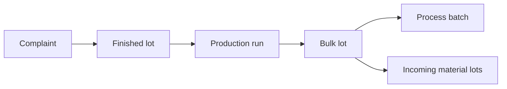

# Complaint

Represents a customer complaint associated with a product and traceable lot.

A complaint records what the customer reported, the affected quantity, when the issue occurred, and how the investigation was resolved.

Through the lot, Pulse can connect a complaint back to the production history that produced the affected product.

## The Complaint object

```json
{
  "code": "CMP-2026-0413",
  "customer": "CUS001",
  "lot": "FG-260810-113",
  "product": "SKU-4471",
  "reason": "CMP-FOREIGN-BODY",
  "detail": "Blue plastic fragment ~4mm found in cup",
  "quantity": 6,
  "unit": "pcs",
  "severity": 4,
  "occurredAt": "2026-08-19T00:00:00+02:00",
  "start": "2026-08-24T09:12:00+02:00",
  "end": "2026-09-02T14:00:00+02:00",
  "outcome": "upheld",
  "disposition": "credit",
  "cost": 184.50,
  "rootCause": "CMP-FOREIGN-BODY"
}
```

## Fields

<div class="attributes-table" markdown>

| Field | Type | Description | Example |
| --- | --- | --- | --- |
| `code` | string | Business code used to identify the complaint in source systems and integrations. | `"CMP-2026-0413"` |
| [`customer`](../master-data/customer.md) | string | Code of the customer associated with the complaint. | `"CUS001"` |
| [`lot`](../master-data/lot.md) | string | Code of the affected lot. | `"FG-260810-113"` |
| [`product`](../master-data/product.md) | string | Code of the affected product. | `"SKU-4471"` |
| [`reason`](../master-data/reason.md) | string | Reason describing the issue as initially reported. | `"CMP-FOREIGN-BODY"` |
| `detail` | string or null | Optional additional description of the reported issue. | `"Blue plastic fragment ~4mm found in cup"` |
| `quantity` | number or null | Optional quantity affected by the complaint. | `6` |
| `unit` | string or null | Unit in which the affected quantity is expressed. | `"pcs"` |
| `severity` | number or null | Optional severity assigned to the complaint. | `4` |
| `occurredAt` | string | Timestamp when the customer experienced the issue, in ISO 8601 format with an explicit offset. | `"2026-08-19T00:00:00+02:00"` |
| `at` | string | Timestamp when the complaint was received or opened, in ISO 8601 format with an explicit offset. | `"2026-08-24T09:12:00+02:00"` |
| `end` | string or null | Timestamp when the complaint investigation was resolved. | `"2026-09-02T14:00:00+02:00"` |
| `outcome` | string or null | Outcome of the complaint investigation. | `"upheld"` |
| `disposition` | string or null | Commercial or operational resolution applied to the complaint. | `"credit"` |
| `cost` | number or null | Cost associated with resolving the complaint, such as a credit or replacement cost. | `184.50` |
| [`rootCause`](../master-data/reason.md) | string or null | Reason identified as the root cause during investigation. | `"CMP-FOREIGN-BODY"` |

</div>

## Complaint lifecycle

A complaint can be submitted when it reaches the plant:

```json
{
  "code": "CMP-2026-0413",
  "customer": "CUS001",
  "lot": "FG-260810-113",
  "product": "SKU-4471",
  "reason": "CMP-FOREIGN-BODY",
  "occurredAt": "2026-08-19T00:00:00+02:00",
  "at": "2026-08-24T09:12:00+02:00"
}
```

When the investigation is complete, submit the same `code` with the fields that became known:

```json
{
  "code": "CMP-2026-0413",
  "end": "2026-09-02T14:00:00+02:00",
  "outcome": "upheld",
  "disposition": "credit",
  "cost": 184.50,
  "rootCause": "CMP-FOREIGN-BODY"
}
```

Fields omitted from the later request remain unchanged.

The time between `at` and `end` represents how long the complaint remained open.

## Reported reason and root cause

`reason` and `rootCause` represent two different facts.

`reason` describes what was initially reported.

`rootCause` describes what the investigation later determined caused the issue.

For example:

```text
Reported reason
    │
    │  CMP-SEAL-FAILURE
    ▼
Investigation
    │
    │  CMP-MACHINE-SETUP
    ▼
Root cause
```

Keeping them separate allows Pulse to distinguish the customer's observed problem from the underlying cause discovered during investigation.

Both values use the shared [Reason](../master-data/reason.md) hierarchy. This allows complaint causes to be analysed alongside related production deviations, stoppages, and maintenance causes.

## Occurrence and reporting time

A complaint has two important timestamps.

`occurredAt` identifies when the customer experienced the issue.

`at` identifies when the complaint reached the plant and the investigation began.

For example:

```text
19 Aug                     24 Aug
  │                          │
  ▼                          ▼
Issue experienced       Complaint received
      <---- 5 days ---->
```

The difference between these timestamps represents the detection or reporting delay.

This distinction matters because a defect discovered shortly after production may have different causes from one discovered later in the product's shelf life.

## Traceability

The lot connects the complaint to the production history that produced the affected product.

Conceptually:



This allows Pulse to investigate complaint patterns against production context rather than analysing only the customer or complaint category.

For example, complaints that initially appear unrelated may share:

- the same production line;
- the same process batch;
- the same incoming material lot or supplier;
- the same recipe;
- the same machine or production condition.

The complaint therefore does not need to reference the historical run directly. The lot genealogy provides that connection.

## Late-arriving complaints

Complaints commonly arrive days or weeks after production has finished.

Submit the complaint when it becomes available rather than trying to modify the historical run.

Pulse associates the complaint with historical production through the lot genealogy.

Because recent production has had less time to accumulate complaints, recent complaint rates may be incomplete. The complaint read surface can indicate this through a maturity marker so that an immature recent period is not mistaken for an improvement.

## API resource

| Resource | Base path |
| --- | --- |
| Complaint | `/services/pulse/food-beverage/complaints` |

See the [API reference](../api/index.md) for supported operations and complete request schemas.

## Depends on

- [Customer](../master-data/customer.md)
- [Lot](../master-data/lot.md)
- [Product](../master-data/product.md)
- [Reason](../master-data/reason.md)
- [Reason](../master-data/reason.md), when `rootCause` is provided

The referenced customer, lot, product, and reason must be available before submitting the complaint.

When `rootCause` is provided, the referenced reason must also be available.