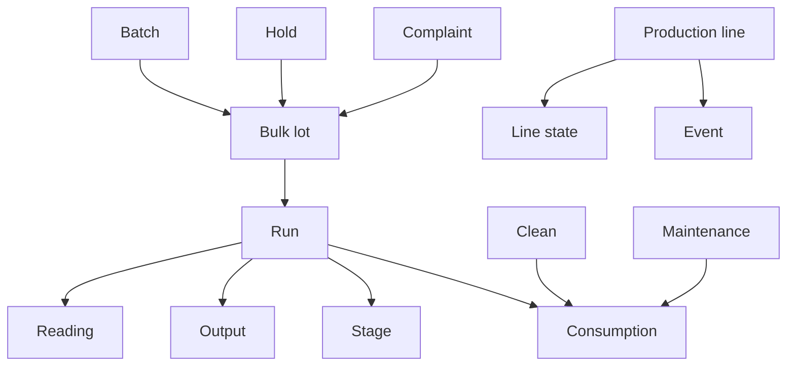

# Manufacturing

Manufacturing data describes the operational work, production context, resource use, output, measurements, quality issues, and line conditions submitted to Pulse.

The Food & Beverage model separates process production, line production, resource consumption, measured signals, quality lifecycle records, and operational events into a small set of domain resources.

Before submitting manufacturing data, synchronize the required [master data](../master-data/index.md).

## Manufacturing structure



The main concepts are:

- A **batch** represents process production such as mixing, cooking, or fermentation.
- A **run** represents production of a specific product on a production line.
- A **stage** represents an execution step within a run.
- **Consumption** records resources actually used by production, cleaning, or maintenance work.
- **Output** records quantities produced by a run.
- **Readings** record measured or commanded values over time.
- **Line states** account for non-running or constrained production-line time.
- **Events** record discrete operational occurrences.
- **Cleans** represent cleaning activities with their own duration and production-transition context.
- **Holds** represent internal quality containment around specific lots.
- **Complaints** represent customer-side quality issues linked back to traceable production lots.

See [Run](run.md) and [Batch](batch.md) for the distinction between line production and process batches.

## Available manufacturing data

### Production work

| Resource | Purpose |
| --- | --- |
| [**Run**](run.md) | Represents a production episode for a product on a production line. |
| [**Batch**](batch.md) | Represents a process batch such as a cook, mix, fermentation, or other bulk-production step. |
| [**Stage**](stage.md) | Represents an execution step within a production run. |
| [**Clean**](clean.md) | Represents a cleaning activity on a production line. |

### Quality lifecycle

| Resource | Purpose |
| --- | --- |
| [**Hold**](hold.md) | Represents a quality hold placed on a specific lot. |
| [**Complaint**](complaint.md) | Represents a customer complaint associated with a product and traceable lot. |

### Operational records

| Resource | Purpose |
| --- | --- |
| [**Consumption**](consumption.md) | Records ingredients, packaging, chemicals, utilities, labor, equipment, and other resources actually consumed. |
| [**Output**](output.md) | Records good output, waste, downgrade, and reject quantities produced during a run. |
| [**Reading**](reading.md) | Records a measured or commanded value at a specific time. |
| [**Line state**](line-state.md) | Records non-running or constrained intervals used for production-line time accounting. |
| [**Event**](event.md) | Records discrete occurrences such as stoppages, deviations, waste, rework, or rejects. |

## Planned and actual data

Planned production quantities and resource requirements are attached to the run plan.

Actual resource use is submitted through [Consumption](consumption.md).

For example:

```text
Run plan
   │
   ├── planned quantity
   └── planned resource items

Actual production
   │
   ├── Consumption
   ├── Output
   ├── Readings
   └── Line states
```

Keeping planned and actual values separate allows Pulse to compare expected and observed production performance.

## Time-based operational data

Several manufacturing resources describe what happened over time:

- Runs, batches, stages, cleans, holds, and complaints have lifecycle timestamps.
- Readings represent values captured at specific instants.
- Output and consumption represent individual operational captures.
- Line states describe intervals of constrained or non-running line time.
- Events represent discrete occurrences and may optionally have a duration.

Use ISO 8601 timestamps with an explicit UTC offset throughout.

## Submission order

Submit referenced records before records that depend on them.

A typical integration flow is:

1. Synchronize the required [master data](../master-data/index.md).
2. Submit process [batches](batch.md) and their produced lots when applicable.
3. Submit production [runs](run.md).
4. Submit [stages](stage.md) associated with runs.
5. Submit actual [consumption](consumption.md), [output](output.md), and [readings](reading.md).
6. Submit [line states](line-state.md) and [events](event.md) as they occur.
7. Submit [cleans](clean.md) and [holds](hold.md) when those activities are relevant.
8. Submit [complaints](complaint.md) when customer-side quality issues become known.

Food & Beverage API requests reference related records by business code rather than Pulse numeric identifiers.

## Corrections and updates

Lifecycle records can be submitted before all values are known.

For example, a run, batch, stage, clean, hold, or complaint can be submitted when it starts and updated later using the same business key.

Fields omitted from a later request remain unchanged.

Repeated stream records such as readings, output, consumption, and line states follow their own record-key and correction rules.

See the [API reference](../api/index.md#manufacturing) for supported operations and complete request schemas.