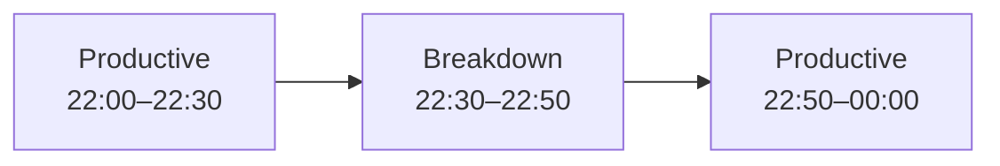

# Line state

Represents a time interval during which a production line was in a specific non-running operating state.

Line states describe how line time was lost or constrained, for example because of cleaning, changeover, breakdown, waiting, blocking, starvation, reduced speed, or another operational condition.

Pulse uses line states to account for the production rhythm of the line over time.

## The Line state object

```json
{
  "state": "cleaning",
  "reason": "Allergen changeover SKU-4471 → SKU-2210",
  "source": "operator",
  "from": "2026-08-11T06:00:00+02:00",
  "to": "2026-08-11T07:45:00+02:00"
}
```

## Fields

<div class="attributes-table" markdown>

| Field | Type | Description | Example |
| --- | --- | --- | --- |
| `state` | string | Operating state of the production line. | `"cleaning"` |
| `reason` | string or null | Optional reason or explanation for the state. | `"Allergen changeover SKU-4471 → SKU-2210"` |
| `source` | string or null | Optional source from which the state was obtained. | `"operator"` |
| `from` | string | Timestamp when the state began, in ISO 8601 format with an explicit offset. | `"2026-08-11T06:00:00+02:00"` |
| `to` | string or null | Optional timestamp when the state ended, in ISO 8601 format with an explicit offset. | `"2026-08-11T07:45:00+02:00"` |

</div>

## Line states

The Food & Beverage model recognizes states such as:

| State | Meaning |
| --- | --- |
| `breakdown` | Production stopped because of an equipment failure. |
| `planned-maintenance` | Production stopped for planned maintenance. |
| `changeover` | The line is changing from one product or format to another. |
| `cleaning` | The line is being cleaned. |
| `waiting-material` | Production cannot continue because required material is unavailable. |
| `waiting-labour` | Production cannot continue because required labor is unavailable. |
| `blocked-downstream` | The line cannot continue because downstream capacity is unavailable. |
| `starved-upstream` | The line cannot continue because upstream product or material is unavailable. |
| `reduced-speed` | The line is running below its expected production speed. |
| `micro-stop` | A short interruption in production. |
| `startup-ramp` | The line is operating during startup or ramp-up. |
| `rework-running` | The line is running while producing or processing rework. |
| `not-scheduled` | The line is not scheduled for production. |

`running` is maintained by Pulse as productive residual time and should not normally be submitted by the integration.

## Open and closed intervals

A line state can be submitted with both `from` and `to` when the complete interval is already known:

```json
{
  "state": "changeover",
  "from": "2026-08-11T05:30:00+02:00",
  "to": "2026-08-11T06:00:00+02:00"
}
```

When the end is not yet known, omit `to`:

```json
{
  "state": "breakdown",
  "source": "operator",
  "from": "2026-08-11T08:12:00+02:00"
}
```

The interval remains open until another state begins or the interval is otherwise closed.

Only one line state can occupy the same period of line time. Overlapping intervals are rejected.

## Gapless time accounting

Line states represent non-running or constrained periods while Pulse treats the remaining line time as productive running time.

Conceptually:



This means an integration does not need to submit a continuous stream of `running` records.

The integration only needs to submit the non-running or constrained interval. The remaining line time is accounted for as productive running time.

## Reasons

Use `reason` when the state alone does not explain why the condition occurred.

For example:

```json
{
  "state": "breakdown",
  "reason": "MECH-BEARING",
  "from": "2026-08-11T08:12:00+02:00",
  "to": "2026-08-11T08:47:00+02:00"
}
```

The state answers **what happened**.

The reason can provide additional context about **why it happened**.

When reasons are maintained as shared master data, use a [Reason](../master-data/reason.md) code rather than creating a different free-text explanation for each occurrence.

## Line states and cleans

A cleaning activity can be represented by both:

- a [Clean](clean.md), which records the cleaning work, regime, product transition, and duration;
- a `cleaning` line state, which accounts for the corresponding period of line time.

These records serve different purposes.

The Clean describes the activity itself.

The line state describes how that activity affected line availability.

## API resource

| Resource | Base path |
| --- | --- |
| Line state | `/services/pulse/food-beverage/lines/{code}/states` |

The `{code}` segment identifies the production line.

See the [API reference](../api/index.md) for supported operations and complete request schemas.

## Depends on

- [Production line](../master-data/production-line.md)
- [Reason](../master-data/reason.md), when a reason code is used

The production line must be available before submitting line states.

When `reason` references shared Reason master data, the referenced reason must also be available.