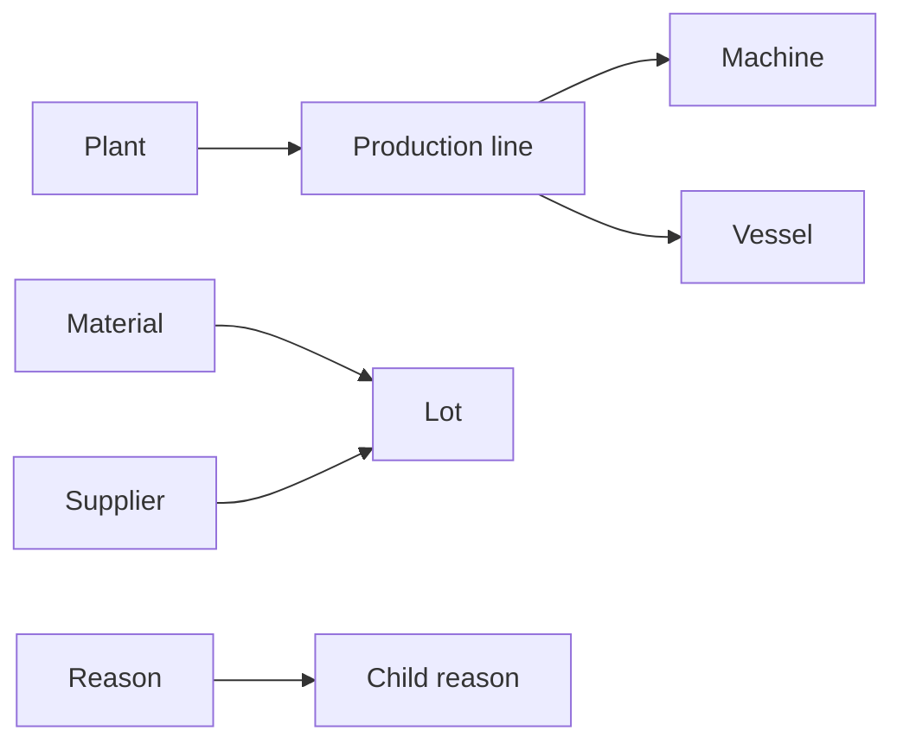

# Master data

Master data defines the relatively stable business records referenced by Food & Beverage operational data submitted to Pulse.

These records describe the production structure, products, materials, traceability entities, classifications, and other context used by runs, batches, readings, consumption, maintenance, complaints, and other operational records.

Register the required master data before submitting operational records that reference it.

## Available master data

### Production structure

| Resource | Purpose |
| --- | --- |
| [**Plant**](plant.md) | Represents a physical operating location. |
| [**Production line**](production-line.md) | Represents a production line within a plant. |
| [**Machine**](machine.md) | Represents a machine, component, or wear part associated with a production line. |
| [**Vessel**](vessel.md) | Represents a tank, silo, or other process vessel associated with a production line. |

### Products and materials

| Resource | Purpose |
| --- | --- |
| [**Product**](product.md) | Represents a finished product or other output tracked in Pulse. |
| [**Recipe**](recipe.md) | Represents a formulation version used during production. |
| [**Material**](material.md) | Represents an ingredient, packaging material, chemical, or other material used in production. |
| [**Lot**](lot.md) | Represents a traceable quantity of material received or produced. |

### Business context

| Resource | Purpose |
| --- | --- |
| [**Supplier**](supplier.md) | Represents a supplier associated with materials and other inputs. |
| [**Customer**](customer.md) | Represents a customer associated with Food & Beverage operations. |
| [**Shift**](shift.md) | Represents a defined work period used to organize operational activity. |
| [**Crew**](crew.md) | Represents a team or operator group used to attribute work and labor consumption. |

### Operational classifications

| Resource | Purpose |
| --- | --- |
| [**Clean regime**](clean-regime.md) | Defines a cleaning regime such as dry clean, wet clean, full CIP, or allergen clean. |
| [**Reason**](reason.md) | Defines a hierarchical cause used by stoppages, maintenance, holds, complaints, and other operational records. |
| [**Metric**](metric.md) | Defines a measurable or commanded signal used by readings and expected values. |
| [**Types and attributes**](types-and-attributes.md) | Explains extensible classifications and additional source-system metadata. |

See the [API reference](../api/index.md) for supported operations and complete request schemas.

## Business codes

Food & Beverage API resources are referenced by business codes rather than Pulse numeric identifiers.

For example:

```json
{
  "code": "YOGURT-LINE-01",
  "name": "Yogurt Filling Line 1",
  "plant": "PLANT-LJ"
}
```

The `plant` field references the plant by its business code.

The same pattern is used throughout the Food & Beverage API. For example:

```json
{
  "material": "MILK-RAW",
  "supplier": "SUP-001"
}
```

and:

```json
{
  "line": "YOGURT-LINE-01",
  "product": "YOG-STRAWBERRY-150G",
  "recipe": "REC-YOG-STRAWBERRY-V3"
}
```

Using business codes keeps requests readable and avoids requiring integrations to maintain a separate mapping of Pulse identifiers.

## Dependencies

Some master-data records depend on other master-data records.



For example:

- A production line references a plant.
- A machine references a production line and may reference another machine as its parent.
- A vessel references a production line.
- A lot references a material and may reference a supplier.
- A child reason may reference another reason as its parent.

Register the referenced record before submitting the dependent record.

## Types and attributes

Master-data records can include extensible properties.

Use `types` for controlled classifications that Pulse should be able to analyse.

Use `attributes` for additional source-system metadata that should be stored but not analysed.

For example:

```json
{
  "types": {
    "storage": "CHILLED",
    "origin": "SI"
  },
  "attributes": {
    "supplierPartNo": "RM-3801"
  }
}
```

See [Types and attributes](types-and-attributes.md) for guidance on choosing between the two.

## Synchronization approach

A typical master-data synchronization performs these steps:

1. Read the relevant records from the source system.
2. Transform each record into the Food & Beverage API format.
3. Submit records in dependency order.
4. Verify the response for each submitted record.
5. Retry or correct rejected records as needed.

Writes are idempotent on the record's `code`. Replaying the same values does not create a duplicate, while corrected values supersede the previous version.

See the [API reference](../api/index.md) for endpoint schemas and supported operations.