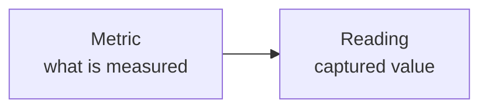

# Measurements

Measurements in the Food & Beverage model use two resources:

- [Metric](master-data/metric.md) defines what is measured or commanded.
- [Reading](manufacturing/reading.md) records an individual captured value.

Each reading references exactly one subject, such as a run, batch, production line, machine, vessel, or lot.

Measured values and setpoints use the same Reading resource. The Metric determines whether the signal represents a measurement or a commanded value.

Expected, target, or permitted ranges are defined separately through [Expected values](expected.md).

## API resources

| Resource | Purpose | Base path |
| --- | --- | --- |
| [Metric](master-data/metric.md) | Declare measurable or commanded signals. | `/services/pulse/food-beverage/metrics` |
| [Reading](manufacturing/reading.md) | Submit captured values. | `/services/pulse/food-beverage/readings` |

See [Metric](master-data/metric.md) and [Reading](manufacturing/reading.md) for the complete object structure and integration guidance.