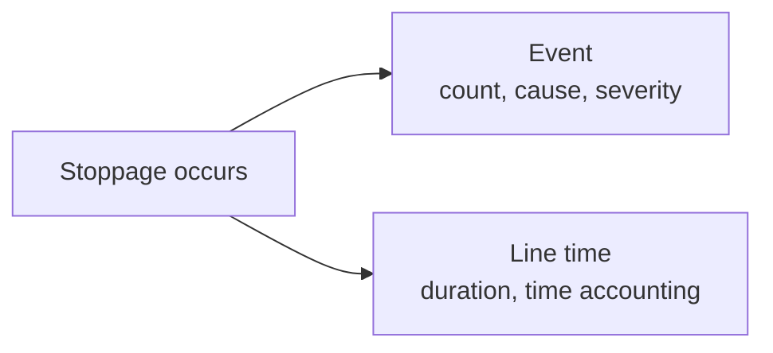

# Event

<!-- TODO: This page is currently based on ApiSurfaceRevised. Revisit it once the implementation is available and verify fields, routes, batching behavior, correction rules, and examples against the current code. -->

Records a discrete operational occurrence.

Events are used for things such as stoppages, waste, specification deviations, CCP deviations, changeovers, and complaints.

## The Event object

```json
{
  "type": "stoppage",
  "line": "LINE001",
  "run": "L01-260810-002",
  "reason": "DTCU010",
  "severity": 2,
  "at": "2026-08-11T03:40:00+02:00",
  "end": "2026-08-11T04:05:00+02:00"
}
```

## Fields

<div class="attributes-table" markdown>

| Field | Type | Description | Example |
| --- | --- | --- | --- |
| `type` | string | Type of event. See the supported values below. | `"stoppage"` |
| [`line`](../master-data/production-line.md) | string | Business code of the production line on which the event occurred. | `"LINE001"` |
| [`run`](../production-activities/run.md) | string or null | Optional business code of the production run associated with the event. | `"L01-260810-002"` |
| [`batch`](../production-activities/batch.md) | string or null | Optional business code of the process batch associated with the event. | `"BULK-260810-07"` |
| [`reason`](../definitions-and-rules/reason.md) | string or null | Optional business code of the reason associated with the event. | `"DTCU010"` |
| `severity` | integer or null | Optional severity from `1` to `5`. | `2` |
| `at` | string | Date and time when the event occurred or started, in ISO 8601 format. | `"2026-08-11T03:40:00+02:00"` |
| `end` | string or null | Optional date and time when the event ended. | `"2026-08-11T04:05:00+02:00"` |

</div>

> [!IMPORTANT]
> `type`, `line`, and `at` together identify an Event record.
>
> `run` and `batch` are mutually exclusive. Provide at most one of them.

## Event types

Supported values for `type` are:

| Type | Meaning |
| --- | --- |
| `stoppage` | A countable production interruption. |
| `waste` | A discrete waste occurrence. |
| `spec-deviation` | A deviation from a declared product or process specification. |
| `ccp-deviation` | A deviation at a critical control point. |
| `changeover` | A discrete production changeover occurrence. |
| `complaint` | A customer complaint occurrence. |

## Run and batch context

Use `run` when the event belongs to line production.

For example:

```json
{
  "type": "waste",
  "line": "LINE001",
  "run": "L01-260810-002",
  "at": "2026-08-11T01:20:00+02:00"
}
```

Use `batch` when the event belongs to bulk processing.

For example:

```json
{
  "type": "waste",
  "line": "LINE001",
  "batch": "BULK-260810-07",
  "at": "2026-08-10T19:20:00+02:00"
}
```

> [!IMPORTANT]
> Do not provide both `run` and `batch` for the same event.
>
> One occurrence should belong to one production context so that its impact is not counted twice.

## Instant and interval events

An event may happen at a single moment:

```json
{
  "type": "spec-deviation",
  "line": "LINE001",
  "run": "L01-260810-002",
  "at": "2026-08-11T02:15:00+02:00"
}
```

Or it may last for a period of time:

```json
{
  "type": "stoppage",
  "line": "LINE001",
  "run": "L01-260810-002",
  "reason": "DTCU010",
  "at": "2026-08-11T03:40:00+02:00",
  "end": "2026-08-11T04:05:00+02:00"
}
```

Use `end` only when the event has a meaningful duration.

## Events and line time

A stoppage can appear both as an Event and as [Line time](line-time.md).

These resources describe different aspects of the same occurrence:



The Event records that the stoppage happened and provides its cause and severity.

Line time records how much production-line time the stoppage consumed.

For example:

```json
{
  "type": "stoppage",
  "line": "LINE001",
  "run": "L01-260810-002",
  "reason": "DTCU010",
  "severity": 2,
  "at": "2026-08-11T03:40:00+02:00",
  "end": "2026-08-11T04:05:00+02:00"
}
```

and:

```json
{
  "line": "LINE001",
  "state": "breakdown",
  "reason": "DTCU010",
  "toldBy": "equipment",
  "from": "2026-08-11T03:40:00+02:00",
  "to": "2026-08-11T04:05:00+02:00"
}
```

are complementary records.

The Event makes the occurrence countable and attributable. Line time makes the lost time part of complete production-time accounting.

## Batching

The specification describes Events as individual records.

Whether the endpoint accepts arrays should be verified against the implementation before documenting batch submission.

## API resource

| Resource | Base path |
| --- | --- |
| `Event` | `/services/pulse/food-beverage/events` |

## API methods

> [!NOTE]
> The API methods below are provisional until the Events implementation is available for verification.

### Submit an event

`POST /services/pulse/food-beverage/events/insert`

Records a discrete operational event.

#### Request

```http
POST /services/pulse/food-beverage/events/insert
Content-Type: application/json
```

```json
{
  "type": "stoppage",
  "line": "LINE001",
  "run": "L01-260810-002",
  "reason": "DTCU010",
  "severity": 2,
  "at": "2026-08-11T03:40:00+02:00",
  "end": "2026-08-11T04:05:00+02:00"
}
```

#### Parameters

| Parameter | Type | Required | Description |
| --- | --- | --- | --- |
| `type` | string | yes | Event type. |
| `line` | string | yes | Business code of the production line. |
| `run` | string or null | no | Business code of the associated production run. |
| `batch` | string or null | no | Business code of the associated process batch. |
| `reason` | string or null | no | Business code of the associated reason. |
| `severity` | integer or null | no | Severity from `1` to `5`. |
| `at` | string | yes | Date and time when the event occurred or started. |
| `end` | string or null | no | Date and time when the event ended. |