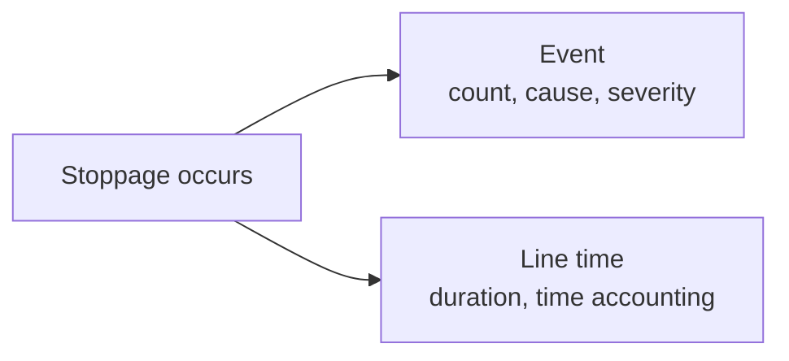

# Event

Records a discrete operational occurrence.

Events are used for things such as stoppages, waste, specification deviations, CCP deviations, changeovers, and complaints.

## The Event object

```json
{
  "type": "stoppage",
  "line": "LINE001",
  "run": "L01-260810-002",
  "reason": "DTCU010",
  "severity": 2,
  "at": "2026-08-11T03:40:00+02:00",
  "end": "2026-08-11T04:05:00+02:00"
}
```

## Fields

<div class="attributes-table" markdown>

| Field | Type | Description | Example |
| --- | --- | --- | --- |
| `type` | string | Type of Event. See the supported values below. | `"stoppage"` |
| [`line`](../master-data/production-line.md) | string | Business code of the Production line on which the Event occurred. | `"LINE001"` |
| [`run`](../production-activities/run.md) | string or null | Optional business code of the Run associated with the Event. | `"L01-260810-002"` |
| [`batch`](../production-activities/batch.md) | string or null | Optional business code of the Batch associated with the Event. | `"BULK-260810-07"` |
| [`reason`](../definitions-and-rules/reason.md) | string or null | Optional business code of the Reason associated with the Event. | `"DTCU010"` |
| `severity` | integer or null | Optional Event severity from `1` to `5`. | `2` |
| `at` | string | Date and time when the Event occurred or started, in ISO 8601 format. | `"2026-08-11T03:40:00+02:00"` |
| `end` | string or null | Date and time when the Event ended, or `null` while it remains open. | `"2026-08-11T04:05:00+02:00"` |

</div>

> [!IMPORTANT]
> `type`, `line`, and `at` together identify an Event.
>
> `line` must reference an existing Production line.
>
> `run` and `batch` are mutually exclusive. Provide at most one of them.
>
> When `run`, `batch`, or `reason` is provided, the referenced record must already exist.

## Event types

Supported values for `type` are:

| Type | Meaning |
| --- | --- |
| `stoppage` | A countable production interruption. |
| `waste` | A discrete waste occurrence. |
| `spec-deviation` | A deviation from a declared Product or process specification. |
| `ccp-deviation` | A deviation at a critical control point. |
| `changeover` | A discrete production changeover occurrence. |
| `complaint` | A complaint occurrence. |

Other Event type codes are not accepted by the Food & Beverage facade.

## Run and batch context

Use `run` when the Event belongs to line production:

```json
{
  "type": "waste",
  "line": "LINE001",
  "run": "L01-260810-002",
  "at": "2026-08-11T01:20:00+02:00"
}
```

Use `batch` when the Event belongs to bulk processing:

```json
{
  "type": "waste",
  "line": "LINE001",
  "batch": "BULK-260810-07",
  "at": "2026-08-10T19:20:00+02:00"
}
```

> [!IMPORTANT]
> Do not provide both `run` and `batch` for the same Event.

An Event may also omit both when it belongs to the Production line without a specific Run or Batch context.

## Instant and interval events

An Event may happen at a single moment:

```json
{
  "type": "spec-deviation",
  "line": "LINE001",
  "run": "L01-260810-002",
  "at": "2026-08-11T02:15:00+02:00"
}
```

Or it may remain open for a period of time:

```json
{
  "type": "stoppage",
  "line": "LINE001",
  "run": "L01-260810-002",
  "reason": "DTCU010",
  "at": "2026-08-11T03:40:00+02:00",
  "end": "2026-08-11T04:05:00+02:00"
}
```

```text
end = null    → open
end supplied  → closed
```

Use `end` when the occurrence has a meaningful duration.

## Event identity and corrections

An Event is identified by:

```text
type + line + at
```

For example:

```text
stoppage / LINE001 / 2026-08-11T03:40:00+02:00
```

Submitting `insert` again with the same `type`, `line`, and `at` does not create a second Event. Pulse updates the existing Event with the submitted values.

This allows source systems to resend or correct an occurrence without creating a duplicate.

## Events and line time

A stoppage can appear both as an Event and as [Line time](line-time.md).

These resources describe different aspects of the same occurrence:



The Event records that the stoppage happened and can provide its cause and severity.

Line time records how much Production-line time the stoppage consumed.

The two records are complementary: Event makes the occurrence countable and attributable, while Line time contributes to complete production-time accounting.

## API resource

| Resource | Base path |
| --- | --- |
| `Event` | `/services/pulse/food-beverage/events` |

## API methods

### Submit an event

`POST /services/pulse/food-beverage/events/insert`

Records one operational Event.

If an Event with the same `type`, `line`, and `at` already exists, the existing Event is updated.

#### Request

```http
POST /services/pulse/food-beverage/events/insert
Content-Type: application/json
```

```json
{
  "type": "stoppage",
  "line": "LINE001",
  "run": "L01-260810-002",
  "reason": "DTCU010",
  "severity": 2,
  "at": "2026-08-11T03:40:00+02:00",
  "end": "2026-08-11T04:05:00+02:00"
}
```

#### Parameters

| Parameter | Type | Required | Description |
| --- | --- | --- | --- |
| `type` | string | yes | Event type. |
| `line` | string | yes | Business code of the Production line. |
| `run` | string or null | no | Business code of the associated Run. |
| `batch` | string or null | no | Business code of the associated Batch. |
| `reason` | string or null | no | Business code of the associated Reason. |
| `severity` | integer or null | no | Severity from `1` to `5`. |
| `at` | string | yes | Date and time when the Event occurred or started. |
| `end` | string or null | no | Date and time when the Event ended. |

### Update an event

`PUT /services/pulse/food-beverage/events/update`

Updates the Event identified by `type`, `line`, and `at`.

#### Request

```http
PUT /services/pulse/food-beverage/events/update
Content-Type: application/json
```

```json
{
  "type": "stoppage",
  "line": "LINE001",
  "run": "L01-260810-002",
  "batch": null,
  "reason": "DTCU010",
  "severity": 3,
  "at": "2026-08-11T03:40:00+02:00",
  "end": "2026-08-11T04:10:00+02:00"
}
```

### Patch an event

`PATCH /services/pulse/food-beverage/events/patch`

Partially updates an existing Event.

The Event is identified by `properties.type`, `properties.line`, and `properties.at`. All three are required.

`run`, `batch`, `reason`, `severity`, and `end` can be explicitly cleared by including them with a null value.

#### Request

```http
PATCH /services/pulse/food-beverage/events/patch
Content-Type: application/json
```

```json
{
  "properties": {
    "type": "stoppage",
    "line": "LINE001",
    "at": "2026-08-11T03:40:00+02:00",
    "end": "2026-08-11T04:10:00+02:00",
    "severity": 3
  }
}
```

#### Parameters

| Parameter | Type | Required | Description |
| --- | --- | --- | --- |
| `properties` | object | yes | Fields included in the partial update. |
| `properties.type` | string | yes | Event type identifying the Event. |
| `properties.line` | string | yes | Production-line business code identifying the Event. |
| `properties.at` | string | yes | Event timestamp identifying the Event. |
| `properties.run` | string or null | no | New Run business code, or `null` to clear it. |
| `properties.batch` | string or null | no | New Batch business code, or `null` to clear it. |
| `properties.reason` | string or null | no | New Reason business code, or `null` to clear it. |
| `properties.severity` | integer or null | no | New severity, or `null` to clear it. |
| `properties.end` | string or null | no | New Event end time, or `null` to leave the Event open. |

### Retrieve an event

`GET /services/pulse/food-beverage/events/select`

Returns the Event identified by its composite business key.

#### Request

```http
GET /services/pulse/food-beverage/events/select?type=stoppage&line=LINE001&at=2026-08-11T03:40:00%2B02:00
```

#### Query parameters

| Parameter | Type | Required | Description |
| --- | --- | --- | --- |
| `type` | string | yes | Event type. |
| `line` | string | yes | Business code of the Production line. |
| `at` | string | yes | Event timestamp. |

### List events

`GET /services/pulse/food-beverage/events/query`

Returns Events matching the supplied filters.

#### Request

```http
GET /services/pulse/food-beverage/events/query?types=stoppage&lines=LINE001&open=true
```

#### Query parameters

| Parameter | Type | Required | Description |
| --- | --- | --- | --- |
| `types` | string or array of strings | no | Limits results to the specified Event types. |
| `lines` | string or array of strings | no | Limits results to Events on the specified Production lines. |
| `runs` | string or array of strings | no | Limits results to Events associated with the specified Runs. |
| `batches` | string or array of strings | no | Limits results to Events associated with the specified Batches. |
| `reasons` | string or array of strings | no | Limits results to Events associated with the specified Reasons. |
| `severities` | integer or array of integers | no | Limits results to the specified severity values. |
| `from` | string | no | Limits results to Events at or after the specified boundary. |
| `to` | string | no | Limits results to Events at or before the specified boundary. |
| `open` | boolean | no | `true` returns open Events; `false` returns closed Events. |

Multiple values can be supplied by repeating the query parameter:

```http
GET /services/pulse/food-beverage/events/query?types=stoppage&types=waste
```

### Delete an event

`DELETE /services/pulse/food-beverage/events/delete`

Deletes the Event identified by its composite business key.

#### Request

```http
DELETE /services/pulse/food-beverage/events/delete?type=stoppage&line=LINE001&at=2026-08-11T03:40:00%2B02:00
```

#### Query parameters

| Parameter | Type | Required | Description |
| --- | --- | --- | --- |
| `type` | string | yes | Event type. |
| `line` | string | yes | Business code of the Production line. |
| `at` | string | yes | Event timestamp. |