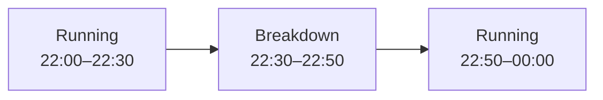
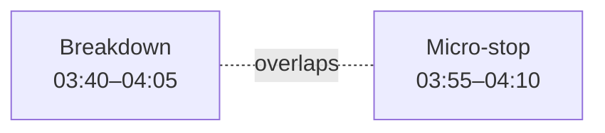

# Line time

<!-- TODO: This page is currently based on ApiSurfaceRevised. Revisit it once the implementation is available and verify fields, routes, batching behavior, correction rules, and examples against the current code. -->

Records intervals when a production line was not running normally.

Line time is used to account for production losses such as breakdowns, micro-stops, waiting, or other non-running states.

## The Line time object

```json
{
  "line": "LINE001",
  "state": "breakdown",
  "reason": "DTCU010",
  "toldBy": "equipment",
  "from": "2026-08-11T03:40:00+02:00",
  "to": "2026-08-11T04:05:00+02:00"
}
```

## Fields

<div class="attributes-table" markdown>

| Field | Type | Description | Example |
| --- | --- | --- | --- |
| [`line`](../master-data/production-line.md) | string | Business code of the production line. | `"LINE001"` |
| `state` | string | State code describing the non-running or constrained interval. Do not submit `running`. | `"breakdown"` |
| [`reason`](../definitions-and-rules/reason.md) | string or null | Optional registered Reason code or free-text explanation. | `"DTCU010"` |
| `toldBy` | string | Source of the state information. Supported values are `equipment` and `operator`. | `"equipment"` |
| `from` | string | Date and time when the interval started, in ISO 8601 format. | `"2026-08-11T03:40:00+02:00"` |
| `to` | string or null | Optional date and time when the interval ended. Omit while the interval is still open. | `"2026-08-11T04:05:00+02:00"` |

</div>

> [!IMPORTANT]
> `line`, `state`, and `from` together identify a Line time record.
>
> Intervals for the same line must not overlap.
>
> Do not submit `running` intervals.

## Running time

Only non-running or constrained states are submitted.

For example:



Only the `Breakdown` interval is submitted to `/line-time`. The gaps around it are interpreted as running time.

Submitting explicit `running` intervals would duplicate that residual time and prevent the line-time accounting from closing correctly.

## Open intervals

An interval can be submitted before its end time is known:

```json
{
  "line": "LINE001",
  "state": "breakdown",
  "reason": "DTCU010",
  "toldBy": "equipment",
  "from": "2026-08-11T03:40:00+02:00"
}
```

When the state ends, submit the same interval with `to`:

```json
{
  "line": "LINE001",
  "state": "breakdown",
  "reason": "DTCU010",
  "toldBy": "equipment",
  "from": "2026-08-11T03:40:00+02:00",
  "to": "2026-08-11T04:05:00+02:00"
}
```

The record is identified by the same `line`, `state`, and `from`.

## Interval ordering and overlap

Line time records may arrive in any order.

For example, a later import may contain an older interval that was entered after the fact.

As long as the interval does not overlap another state for the same line, it can still be recorded.

Two intervals covering the same time on the same line are not valid.

For example:


These intervals overlap and cannot both describe the line at the same time.


> [!WARNING]
> Two Line time records for the same production line must not cover the same period.


## Source of the state

`toldBy` records how the state was identified.

| Value | Meaning |
| --- | --- |
| `equipment` | The state was reported automatically by equipment or another production system. |
| `operator` | The state was declared manually by an operator. |

This allows Pulse to preserve the provenance of the operational state rather than treating automatically detected and manually entered states as equivalent evidence.

## Reasons

`reason` can provide additional context for the state.

When the source system has a registered reason code, use the code:

```json
{
  "state": "breakdown",
  "reason": "DTCU010"
}
```

Free text may also be supplied where no registered reason exists.

Using registered [Reason](../definitions-and-rules/reason.md) codes provides more consistent grouping and analysis across intervals.

## Batching

The specification shows Line time accepting multiple intervals in one request:

```json
[
  {
    "line": "LINE001",
    "state": "breakdown",
    "reason": "DTCU010",
    "toldBy": "equipment",
    "from": "2026-08-11T03:40:00+02:00",
    "to": "2026-08-11T04:05:00+02:00"
  },
  {
    "line": "LINE001",
    "state": "micro-stop",
    "toldBy": "equipment",
    "from": "2026-08-11T01:22:00+02:00",
    "to": "2026-08-11T01:26:00+02:00"
  }
]
```

The exact batching behavior should be verified once the implementation is available.

## API resource

| Resource | Base path |
| --- | --- |
| `Line time` | `/services/pulse/food-beverage/line-time` |

## API methods

> [!NOTE]
> The API methods below are provisional until the Line time implementation is available for verification.

### Submit line time

`POST /services/pulse/food-beverage/line-time/insert`

Records one or more non-running or constrained line intervals.

#### Request

```http
POST /services/pulse/food-beverage/line-time/insert
Content-Type: application/json
```

```json
[
  {
    "line": "LINE001",
    "state": "breakdown",
    "reason": "DTCU010",
    "toldBy": "equipment",
    "from": "2026-08-11T03:40:00+02:00",
    "to": "2026-08-11T04:05:00+02:00"
  },
  {
    "line": "LINE001",
    "state": "micro-stop",
    "toldBy": "equipment",
    "from": "2026-08-11T01:22:00+02:00",
    "to": "2026-08-11T01:26:00+02:00"
  }
]
```

#### Parameters

| Parameter | Type | Required | Description |
| --- | --- | --- | --- |
| `line` | string | yes | Business code of the production line. |
| `state` | string | yes | Non-running or constrained line-state code. |
| `reason` | string or null | no | Registered Reason code or free-text explanation. |
| `toldBy` | string | yes | `equipment` or `operator`. |
| `from` | string | yes | Date and time when the interval started. |
| `to` | string or null | no | Date and time when the interval ended. |