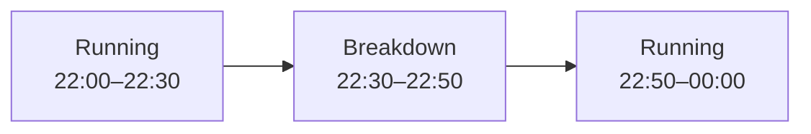

# Line time

Records intervals when a Production line was in a declared non-running or constrained condition.

Line time is used to account for production losses such as breakdowns, micro-stops, waiting, or other non-running conditions.

## The Line time object

```json
{
  "line": "LINE001",
  "condition": "breakdown",
  "reason": "DTCU010",
  "toldBy": "equipment",
  "from": "2026-08-11T03:40:00+02:00",
  "to": "2026-08-11T04:05:00+02:00"
}
```

## Fields

<div class="attributes-table" markdown>

| Field | Type | Description | Example |
| --- | --- | --- | --- |
| [`line`](../master-data/production-line.md) | string | Business code of the Production line. | `"LINE001"` |
| `condition` | string | Registered line-condition code. The productive `running` condition must not be submitted explicitly. | `"breakdown"` |
| [`reason`](../definitions-and-rules/reason.md) | string or null | Optional registered Reason code or free-text explanation. | `"DTCU010"` |
| `toldBy` | string | Source of the condition information. Supported values are `equipment` and `operator`. | `"equipment"` |
| `from` | string | Date and time when the interval started, in ISO 8601 format. | `"2026-08-11T03:40:00+02:00"` |
| `to` | string or null | Date and time when the interval ended, or `null` while it remains open. | `"2026-08-11T04:05:00+02:00"` |

</div>

> [!IMPORTANT]
> `line`, `condition`, and `from` together identify a Line time record.
>
> `line` must reference an existing Production line.
>
> `condition` must be a registered value of the `state` Type.
>
> Do not submit the `running` condition.

## Running time

The productive `running` condition is not recorded explicitly.

For example:



Only the `breakdown` interval is submitted.

When Line time is queried for a bounded time window and `running` is requested, Pulse can derive the productive intervals from gaps between the explicitly recorded conditions.

For example:

```http
GET /services/pulse/food-beverage/line-time/query?lines=LINE001&conditions=running&from=2026-08-10T22:00:00%2B02:00&to=2026-08-11T00:00:00%2B02:00
```

may return the two running intervals surrounding the recorded breakdown.

Derived `running` intervals have:

```json
{
  "condition": "running",
  "reason": null,
  "toldBy": "equipment"
}
```

## Open intervals

An interval can be submitted before its end time is known:

```json
{
  "line": "LINE001",
  "condition": "breakdown",
  "reason": "DTCU010",
  "toldBy": "equipment",
  "from": "2026-08-11T03:40:00+02:00"
}
```

When the condition ends, the existing interval can be corrected by submitting the same `line`, `condition`, and `from` with `to`:

```json
{
  "line": "LINE001",
  "condition": "breakdown",
  "reason": "DTCU010",
  "toldBy": "equipment",
  "from": "2026-08-11T03:40:00+02:00",
  "to": "2026-08-11T04:05:00+02:00"
}
```

```text
to = null    → open
to supplied  → closed
```

## Condition identity and corrections

A Line time interval is identified by:

```text
line + condition + from
```

For example:

```text
LINE001 / breakdown / 2026-08-11T03:40:00+02:00
```

Submitting `insert` again with the same composite key updates the existing interval rather than creating another one.

This allows source systems to resend an interval later when its end time or other details become known.

## Source of the condition

`toldBy` records how the condition was identified.

| Value | Meaning |
| --- | --- |
| `equipment` | The condition was reported automatically by equipment or another production system. |
| `operator` | The condition was declared manually by an operator. |

## Reasons

`reason` can provide additional context for the condition.

When the source system has a registered Reason code, use that code:

```json
{
  "condition": "breakdown",
  "reason": "DTCU010"
}
```

Free text may also be supplied when no registered Reason exists.

Using registered [Reason](../definitions-and-rules/reason.md) codes provides more consistent grouping and analysis.

## API resource

| Resource | Base path |
| --- | --- |
| `Line time` | `/services/pulse/food-beverage/line-time` |

## API methods

### Submit line time

`POST /services/pulse/food-beverage/line-time/insert`

Records one non-running or constrained Line time interval.

If an interval with the same `line`, `condition`, and `from` already exists, the existing interval is updated.

#### Request

```http
POST /services/pulse/food-beverage/line-time/insert
Content-Type: application/json
```

```json
{
  "line": "LINE001",
  "condition": "breakdown",
  "reason": "DTCU010",
  "toldBy": "equipment",
  "from": "2026-08-11T03:40:00+02:00",
  "to": "2026-08-11T04:05:00+02:00"
}
```

#### Parameters

| Parameter | Type | Required | Description |
| --- | --- | --- | --- |
| `line` | string | yes | Business code of the Production line. |
| `condition` | string | yes | Registered line-condition code. `running` is not accepted. |
| `reason` | string or null | no | Registered Reason code or free-text explanation. |
| `toldBy` | string | yes | `equipment` or `operator`. |
| `from` | string | yes | Date and time when the interval started. |
| `to` | string or null | no | Date and time when the interval ended. |

### Update line time

`PUT /services/pulse/food-beverage/line-time/update`

Updates the Line time interval identified by `line`, `condition`, and `from`.

#### Request

```http
PUT /services/pulse/food-beverage/line-time/update
Content-Type: application/json
```

```json
{
  "line": "LINE001",
  "condition": "breakdown",
  "reason": "DTCU010",
  "toldBy": "equipment",
  "from": "2026-08-11T03:40:00+02:00",
  "to": "2026-08-11T04:10:00+02:00"
}
```

### Patch line time

`PATCH /services/pulse/food-beverage/line-time/patch`

Partially updates an existing Line time interval.

The interval is identified by `properties.line`, `properties.condition`, and `properties.from`. All three are required.

`reason` and `to` can be explicitly cleared by including them with a null value.

#### Request

```http
PATCH /services/pulse/food-beverage/line-time/patch
Content-Type: application/json
```

```json
{
  "properties": {
    "line": "LINE001",
    "condition": "breakdown",
    "from": "2026-08-11T03:40:00+02:00",
    "to": "2026-08-11T04:10:00+02:00"
  }
}
```

#### Parameters

| Parameter | Type | Required | Description |
| --- | --- | --- | --- |
| `properties` | object | yes | Fields included in the partial update. |
| `properties.line` | string | yes | Production-line business code identifying the interval. |
| `properties.condition` | string | yes | Condition code identifying the interval. |
| `properties.from` | string | yes | Start time identifying the interval. |
| `properties.reason` | string or null | no | New Reason or free-text explanation, or `null` to clear it. |
| `properties.toldBy` | string | no | New reporter: `equipment` or `operator`. |
| `properties.to` | string or null | no | New end time, or `null` to leave the interval open. |

### Retrieve line time

`GET /services/pulse/food-beverage/line-time/select`

Returns the Line time interval identified by its composite business key.

#### Request

```http
GET /services/pulse/food-beverage/line-time/select?line=LINE001&condition=breakdown&from=2026-08-11T03:40:00%2B02:00
```

#### Query parameters

| Parameter | Type | Required | Description |
| --- | --- | --- | --- |
| `line` | string | yes | Business code of the Production line. |
| `condition` | string | yes | Condition code. |
| `from` | string | yes | Interval start date and time. |

### List line time

`GET /services/pulse/food-beverage/line-time/query`

Returns Line time intervals matching the supplied filters.

#### Request

```http
GET /services/pulse/food-beverage/line-time/query?lines=LINE001&conditions=breakdown
```

#### Query parameters

| Parameter | Type | Required | Description |
| --- | --- | --- | --- |
| `lines` | string or array of strings | no | Limits results to the specified Production lines. |
| `conditions` | string or array of strings | no | Limits results to the specified conditions. |
| `reasons` | string or array of strings | no | Limits results to the specified Reasons or reason strings. |
| `toldBy` | string or array of strings | no | Limits results to the specified reporters. |
| `from` | string | no | Beginning of the requested time window. |
| `to` | string | no | End of the requested time window. |
| `open` | boolean | no | `true` returns open intervals; `false` returns closed intervals. |

Multiple values can be supplied by repeating the query parameter:

```http
GET /services/pulse/food-beverage/line-time/query?conditions=breakdown&conditions=micro-stop
```

### Delete line time

`DELETE /services/pulse/food-beverage/line-time/delete`

Deletes the Line time interval identified by its composite business key.

#### Request

```http
DELETE /services/pulse/food-beverage/line-time/delete?line=LINE001&condition=breakdown&from=2026-08-11T03:40:00%2B02:00
```

#### Query parameters

| Parameter | Type | Required | Description |
| --- | --- | --- | --- |
| `line` | string | yes | Business code of the Production line. |
| `condition` | string | yes | Condition code. |
| `from` | string | yes | Interval start date and time. |