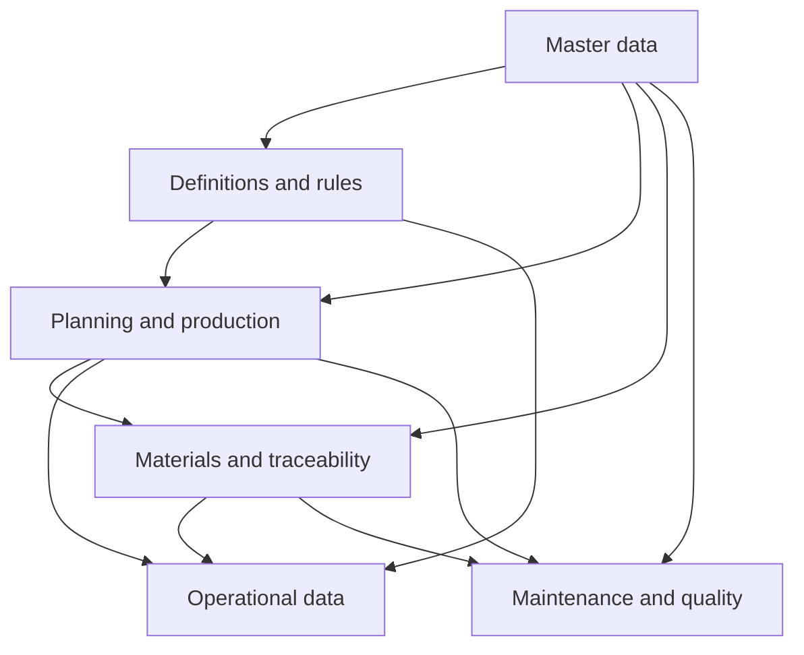

# Metal & Machining

The Metal & Machining model represents discrete manufacturing processes such as turning, milling, grinding, welding, heat treatment, inspection, and subcontracted production.

It covers production structure, jobs and routing, machine and tooling activity, material traceability, dimensional measurements, resource use, maintenance, quality, and operational events.

## What is specific to this model

When integrating Metal & Machining production, pay particular attention to:

- **Jobs and operations** as the main structure for tracking production work.
- **Routing and planned production** for comparing expected setup, run time, and resource use with actual results.
- **Parts and features** for representing drawing-controlled dimensions and other measurable characteristics.
- **Feature measurements** for recording individual inspection results against the relevant part feature.
- **Machines, tools, fixtures, and gauges** as production and measurement resources.
- **Material traceability** through heats, suppliers, certificates, and consumption.
- **Tool traceability and life** through tool batches, usage, and tool changes.
- **Machine time accounting** for setup, breakdowns, waiting, maintenance, and other non-productive states.
- **Inspection and nonconformance** for recording quality gates, defects, disposition, and rework.
- **Subcontracted operations** where production work is performed by an external supplier.
- **Maintenance and customer quality** through work orders, nonconformances, and complaints.

## Excel integration template

For integrations based on file exchange, Pulse provides a Metal & Machining Excel template for preparing data in the structure expected by the specialization.

The workbook can be completed manually for smaller datasets, while larger operational datasets can be populated from source systems.

The completed workbook can be imported into Pulse, where its data is mapped to the corresponding Metal & Machining resources.

## Integration flow



The exact submission order depends on the source system and the records being integrated. Referenced records must exist before records that depend on them.

## Before you begin

You need:

- The API base URL assigned to your organization.
- A valid API token.
- Access to the Pulse API reference in Scalar.
- Access to the source data you want to submit.

See [Authentication](../../../getting-started/authentication.md) and [First API request](first-api-request.md).

## Map source data to the Metal & Machining model

Start by identifying how records from the source system map to the Metal & Machining resources.

### Master data

Register relatively stable business records such as:

- Sites
- Work centres
- Machines
- Tools
- Fixtures
- Gauges
- Parts
- Features
- Programs
- Materials
- Suppliers
- Customers
- Shifts
- Crews

See [Master data](master-data/index.md).

### Definitions and rules

Define measurements, expected values, classifications, and reason codes used by production data.

See [Definitions and rules](definitions-and-rules/index.md).

### Planning and production

Describe the work that is planned and performed:

- Jobs
- Routing
- Operations
- Planned use
- Steps
- Subcontracted operations
- Treatment batches
- Inspections

See [Planning and production](planning-and-production/index.md).

### Materials and traceability

Track incoming material and tooling back to their source:

- Heats
- Material certificates
- Tool batches

See [Materials and traceability](materials-and-traceability/index.md).

### Operational data

Submit what actually happened during production:

- Feature measurements
- Readings
- Output
- Consumption
- Machine time
- Events
- Tool changes

See [Operational data](operational-data/index.md).

### Maintenance and quality

Submit maintenance and quality records:

- Work orders
- Nonconformances
- Complaints

See [Maintenance and quality](maintenance-and-quality/index.md).

## Resource identity

Metal & Machining resources use the documented business identifiers for records and relationships.

Do not use internal Pulse numeric identifiers when creating references between resources.

Some resources may use composite business keys. See [Resource identity](../../../api-conventions/resource-identity.md) for the general rules.

## Timestamps

Use ISO 8601 timestamps with an explicit UTC offset where a date and time is required.

For example:

```text
2026-08-19T13:40:00+02:00

```

## Validate the integration

Before submitting data:

- Confirm required referenced records exist.
- Use supported enum values.
- Use the documented business identifiers.
- Use valid timestamps.
- Use the documented quantity and unit fields.
- Inspect API responses before submitting dependent records.

See [Validation](../../../validation.md) and [Troubleshooting](../../../troubleshooting.md).

## Metal & Machining integration areas

| Area | Purpose |
| --- | --- |
| [**Master data**](master-data/index.md) | Stable production, equipment, part, tooling, and business records. |
| [**Definitions and rules**](definitions-and-rules/index.md) | Measurements, expectations, classifications, and reason codes. |
| [**Planning and production**](planning-and-production/index.md) | Jobs, routing, operations, steps, subcontracting, and inspection. |
| [**Materials and traceability**](materials-and-traceability/index.md) | Material heats, certificates, tooling batches, and supplier traceability. |
| [**Operational data**](operational-data/index.md) | Measurements, readings, output, consumption, machine time, events, and tool changes. |
| [**Maintenance and quality**](maintenance-and-quality/index.md) | Work orders, nonconformances, and complaints. |

## Recommended next steps

1. Complete [Authentication](../../../getting-started/authentication.md).
2. Send the [First API request](first-api-request.md).
3. Review the [Metal & Machining data model](data-model.md).
4. Follow the [end-to-end Metal & Machining scenario](end-to-end-integration.md).
5. Use the [API reference](api/index.md) to inspect resource paths and operations.
